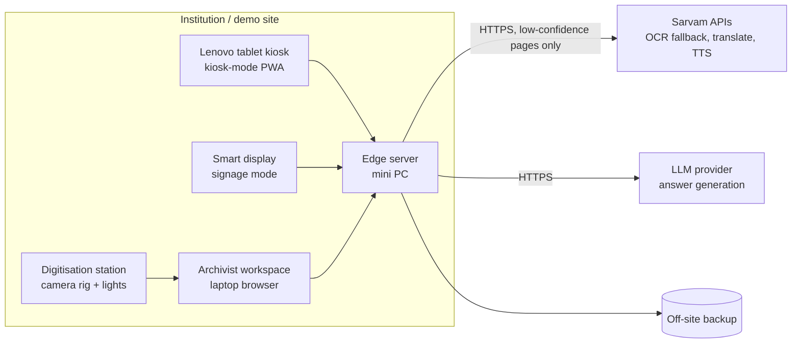
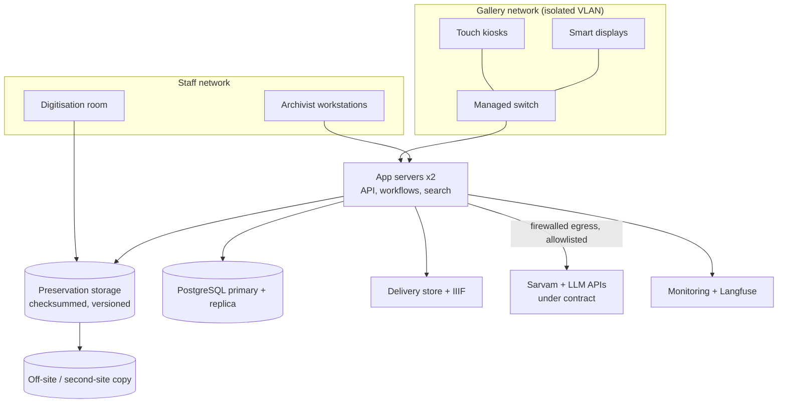

# Ambedkar Digital Heritage Archive — Revised Architecture Spec

Sep 26, 2026 · @KidZdo

## 1. Purpose and how to use this spec

This spec defines a hardware-software prototype for SIH (MoSJE, Hardware category, Smart Education theme): an AI-enabled digital heritage archive and institutional knowledge platform for Dr. B. R. Ambedkar. It replaces the earlier draft and closes its gaps against the problem statement, the Hardware category and implementability.

The architecture team (or an AI assistant acting as senior solutions architect) must treat every requirement below as binding. Do not replace it with a generic chatbot architecture. Do not claim a component is built, measured or licensed without evidence.

**Priority labels used throughout**

| Label | Meaning |
| --- | --- |
| **\[P1\] Prototype** | Must work in the first-round SIH demo |
| **\[P2\] Later** | Designed now, built after round one |
| **\[PROD\] Production** | Required before an institution goes live; never presented as a prototype capability |

**Non-negotiable principles**

1. The original archival item (scan, recording, photograph) is the authoritative source. Extracted text, translations, summaries, captions, narration and AI answers are separately labelled derivatives with provenance.
2. Visitors see only published, rights-cleared items. A derivative reaches visitors only under its rule in §1.1; there are no other exceptions.
3. Every passage the system shows or cites links back to an original page region or media timestamp, with edition and volume.
4. Browsing, timeline, reading and media playback make zero LLM calls.
5. The AI answers only from the archive. If the archive does not support an answer, it says so.
6. Nothing is attributed to Dr. Ambedkar without a verifiable citation, and no synthetic audio imitates his voice.

### 1.1 Publication rule per derivative

This table is the single publication rule. §4 and §5 follow it.

| Derivative | Rule before a visitor can see it | Searchable / citable | Label shown |
| --- | --- | --- | --- |
| Text layer of a born-digital item | Archivist spot-check approved | Yes | Source text |
| Local OCR text, page passed the gate | Batch approved after a passed random sample (§4.5) | Yes | Reviewed transcription |
| Sarvam OCR text | Full archivist review, always; never auto-accepted | Yes, after approval | Reviewed transcription |
| Conflicting or failed-page OCR | Full archivist review and correction | Yes, after approval | Reviewed transcription |
| Handwritten transcription | Full review | Yes, after approval | Reviewed transcription |
| Audio/video transcript | Full review | Yes, after approval | Reviewed transcript |
| Photo caption and metadata | Full review | Yes, after approval | — |
| Summary | Full review | No (not a source) | Reviewed summary |
| Timeline event, story, knowledge-map node or edge | Curator approval | Browsable, not citable as source | — |
| Pre-generated translation | Full review by a named reviewer for that language | Yes, after approval | Reviewed translation |
| On-demand machine translation | Not reviewed. Generated live only from approved text of a published item; not stored for other visitors; can be switched off per collection | No | Machine translation — not reviewed |
| Narration audio | Generated only from approved source text or a reviewed translation | No | Synthetic narration |
| AI answer | Not reviewed. Generated live only from approved passages; not stored as archive content | No | AI-generated answer from archive sources |

**Direct-quotation rule.** An answer, story, summary or caption may quote Dr. Ambedkar's words directly only from a passage on a **quote-verified** page: a person has compared that page's approved text with the original scan, word for word. Batch-approved OCR pages and spot-checked born-digital text can be searched, paraphrased and cited, but not quoted, until verified. Pages used in stories, the timeline and the demo question set are verified first.

## 2. Problem-statement traceability

Every item in the MoSJE problem statement maps to a section here. The architecture response must keep this table and show where each item is met.

| Problem-statement item | Where covered | Priority |
| --- | --- | --- |
| Interactive touch-screen kiosks | §3 tablet kiosk; §9 installed kiosks | P1 / PROD |
| Smart displays | §3 signage display loop (P1); "send to big screen" (P2) | P1 |
| Centralized archival servers | §3 edge server; §9 preservation + central tiers | P1 / PROD |
| AI-powered semantic search | §5 hybrid search | P1 |
| Intelligent knowledge mapping | §5 knowledge map, §7 relationship model | P1 (curated subset) |
| Full-text access to writings and speeches | §5 reader beside original scan | P1 |
| Summarized access | §4 reviewed summaries generated at ingestion | P1 (2–3 items) |
| OCR-based digitization of old documents and manuscripts | §3 digitisation station, live capture in the core demo (§8.2); §4 OCR routing | P1 |
| Multilingual translation | §5 Indian-language access | P1 (EN, HI, MR) |
| Audio narration | §5 cached TTS narration, labelled synthetic | P1 |
| Audio-video archive: lectures, documentaries, interviews | §4 timestamped transcripts; §5 player | P1 (one recording) |
| Interactive timeline | §5 curated timeline | P1 |
| Memorial storytelling | §5 story modules; §4 curator editor | P1 (one story) |
| AI Research Assistant | §5 bounded LangGraph workflow | P1 |
| Secure digital preservation | §6.5, §9 fixity, backups, restore tests | P1 basic / PROD full |
| Metadata tagging | §4 metadata capture, §7 data model | P1 |
| Institutional archival management | §3 archivist workspace, roles | P1 |
| Visitors can search, study, listen to **and compile** | §5 "My collection" + QR take-away | P1 |
| Researchers, students, general public | §5 visitor kiosk; researcher web view | P1 / P2 |
| Constitutional awareness | §5 debates linked to Constitution articles | P1 (subset) |
| Accessible learning | §5 accessibility requirements | P1 |
| Datasets: Dr. Ambedkar Foundation, Constituent Assembly Debates, NDLI | §8.1 collection and rights register (NDLI: discovery and linking only) | P1 |
| Domain-adapted model trained on eligible archive data (team addition supporting "AI-enabled" and semantic search) | §4.10 training-eligible corpus; §7.3 training workflow; §8.3 training-preparation module; §10.2 results | P1: training-eligible corpus, dataset preparation, base-model baseline. P2: trained model, only after the §7.3 minimum-data gate |

## 3. Core approach and hardware

The prototype has four physical tiers, so the Hardware-category build is more than a tablet on a stand. Heavy work (OCR, indexing, embeddings, LLM calls) never runs on the tablet.

### 3.1 Hardware tiers

| Tier | Prototype hardware \[P1\] | Purpose | Production equivalent \[PROD\] |
| --- | --- | --- | --- |
| Visitor kiosk | Lenovo Android tablet on a lockable stand, headphone output | Touch browsing, reading, media, typed questions | Commercial touch kiosk or mains-powered all-in-one, enclosure, induction loop |
| Smart display | TV or monitor driven by the edge server (or a stick PC) in a full-screen browser | Curated loops and timeline \[P1\]; "send to big screen" from a kiosk \[P2\] | Commercial signage displays with managed players |
| Digitisation station | Overhead document camera or copy stand with a mirrorless camera, two daylight lamps, colour/grey target, book cradle | Captures scans of printed pages and manuscripts as preservation masters | Professional book scanner or outsourced digitisation to a written capture standard |
| Edge server (local institutional infrastructure) | Mini PC, starting spec 32 GB RAM, 1 TB SSD, GPU optional; confirmed or changed by the §3.4 benchmark | Local OCR, embeddings, search, metadata DB, exhibit cache, API, Langfuse | On-premise server pair plus preservation storage (§9) |
| Central backend (external) | Sarvam APIs and one LLM API, reached from the edge server only | OCR fallback, translation, narration, answer generation | Same, under contract, or self-hosted models where the institution requires it |

The tablet never calls external AI services directly. All calls go through the edge server, which enforces rights, caching, redaction and cost limits.

### 3.2 Two distinct experiences

- **Archivist workspace** (authenticated, laptop browser): ingest, OCR review, transcript and caption review, translation review, curation of timeline, stories and knowledge map, publication, audit history.
- **Visitor experience** (anonymous, read-only, kiosk and display): browse, search, read beside the original, watch, listen, compile, ask cited questions.

### 3.3 Kiosk client

- One progressive web app (PWA) serves both kiosk and smart display, with a display-specific layout. **\[P1\]**
- Android pinned/lock-task mode or a kiosk browser keeps visitors inside the app. **\[P1\]**
- A service worker caches the published exhibit set for offline use. **\[P1\]**
- Device management (remote update, remote wipe, fleet health) is **\[PROD\]**.

### 3.4 Edge-server capacity benchmark \[P1, before committing hardware\]

One mini PC is a starting point, not a decision. Local OCR, embeddings, reranking, PostgreSQL, IIIF image serving, FFmpeg and self-hosted Langfuse (which runs its own supporting services, such as ClickHouse, Redis and an object store) may compete for CPU, RAM and disk I/O.

1. **Load:** run a representative ingestion batch (OCR, embeddings, media transcoding) while a script simulates visitor sessions from the planned number of kiosks (search, page open, Ask).
2. **Measure:** p50/p95 visitor latency for search, page open and Ask (with external provider time reported separately), ingestion throughput in pages per hour, CPU, RAM, swap and disk I/O. Record results in §10.
3. **Decide** against latency targets the team sets before the test. If visitor latency degrades during ingestion, apply in order:
   1. Schedule batch ingestion outside visitor hours and cap its CPU and memory
   2. Move Langfuse to a separate machine
   3. Move batch processing (OCR, embeddings, transcoding) to a second machine or a GPU box, leaving the edge server to serve visitors

On shared hardware, visitor serving always has priority over ingestion.

## 4. Ingestion requirements

Ingestion is a LangGraph state machine with deterministic routing, but the metadata database is the source of truth for item, page and review state. LangGraph checkpoints (Postgres checkpointer) hold workflow position only, because review pauses can last days.

### 4.1 Intake \[P1\]

1. Capture: source institution, title, item type, original language(s) and script(s), date or date range (with certainty), **edition, volume and publisher**, rights status and rights holder, access level, file version, and capture details (device, operator, date) for station scans.
2. Validate format and integrity. Compute SHA-256 on arrival.
3. Detect exact duplicates by checksum. Flag near-duplicates (a re-scan, another reprint or edition) with perceptual page hashes and text similarity, for archivist decision. Never auto-merge editions.
4. Store the original unchanged in preservation storage before any processing.

### 4.2 Route by document class \[P1\]

| Class | Route | Notes |
| --- | --- | --- |
| Born-digital text or PDF with a reliable text layer | Extract text; spot-check against page image | Covers much of *Writings and Speeches* and the Lok Sabha Debates volumes. Do not OCR what is already text. |
| Printed or typewritten scan | Preprocess, local OCR, quality gate, Sarvam fallback for failed pages | Main OCR path |
| Handwritten manuscript | Human transcription, optionally assisted by OCR or Sarvam draft | Local OCR will usually fail; do not count these pages in the OCR fallback rate |
| Photograph | Reviewed caption, people, place, date, event, source; no OCR except for visible printed text such as a banner, stored separately | OCR is not image understanding |
| Audio or video | Speech-to-text draft, then human-reviewed, timestamped transcript and speaker labels | Delivery copies generated separately (§6.4) |

### 4.3 Local OCR and the quality gate \[P1\]

- **Preprocess:** deskew, crop, denoise, contrast normalise, split two-page spreads. Keep preprocessing parameters with the page record.
- **Local OCR engine:** one named engine with English, Hindi and Marathi models (for example Tesseract with `eng`/`hin`/`mar`, or Surya). The team chooses and records its reason, then benchmarks it on the ground-truth set in §10.
- **Output format:** word-level text with confidence and bounding boxes, stored as ALTO XML or hOCR so citations can highlight the exact region on the scan.
- **Per-page quality signals:**
  1. Mean and low-percentile word confidence
  2. Coverage: area of layout-detected text blocks that produced OCR text, as a share of all detected text blocks. This is how "visible missing regions" is measured.
  3. Script and language consistency: share of characters in the expected script, plus dictionary-word ratio per language
  4. Garbage-token rate (non-words, stray symbols)
- **Calibration:** do not invent a universal threshold. Hand-transcribe a sample of pages per document class and language (§10). Pick thresholds that catch the pages whose word error rate is unacceptable to the archivist, and record the threshold version on every page decision.

### 4.4 Sarvam fallback (OCR only) \[P1\]

- Pages that fail the gate go to Sarvam Vision / the Sarvam Document Intelligence API. Only failed pages are sent, never whole volumes, and never items whose access level forbids external processing.
- Keep both results (local and Sarvam) with engine, version, timestamp and page reference.
- A Sarvam result is never auto-accepted (§1.1). It always goes to archivist review with the scan, the local result and a diff side by side. Its gate score and the amount of disagreement only set review priority.
- Retries use backoff and a retry limit. On final failure the page goes to manual transcription; the item never silently publishes with missing pages.

### 4.5 Human review \[P1\]

- **Full review:** every page that failed the gate, every Sarvam result, every conflicting result, every handwritten transcription, audio/video transcript, photo caption, summary and pre-generated translation.
- **Sampled review:** only pages that passed the local gate. They are approved in batches after the archivist checks a random sample per batch. A failed sample sends the whole batch to full review.
- Each decision is a review record (§7) with reviewer, action, before/after text and reason. Visibility follows §1.1; only approved text is indexed.

### 4.6 Derivatives generated at ingestion \[P1\]

- **Summaries:** LLM-drafted from approved text only, one per item or chapter, labelled "AI-generated summary" until reviewed. Visitors see only reviewed summaries. Viewing a summary costs zero LLM calls.
- **Knowledge-map proposals:** named-entity and link suggestions (people, events, places, concepts, works, Constitution articles, debate sessions). An archivist approves each node and edge.
- **Translations and narration** for commonly used items are pre-generated and cached (§5.5).

### 4.7 Publication \[P1\]

Publication spans PostgreSQL, file storage, search indexes and kiosk caches, so it cannot be one atomic transaction. It is a staged, versioned switch that the LangGraph ingestion graph runs and can resume after failure.

1. **Stage:** write delivery copies to file storage, and write the item version's metadata, passages, embeddings, knowledge-map and timeline records under a new `item_version`, not yet visible.
2. **Verify:** confirm checksums of delivery files, passage and embedding counts in the index match the approved text, and every passage resolves to a page region or timestamp. A failed check stops publication and alerts the archivist.
3. **Switch:** in one PostgreSQL transaction, set the item's `published_version` to the new version and state to `published`. The visitor API only serves the `published_version`, so visitors never see a half-published item.
4. **Propagate:** kiosk caches pick up the new version on their next sync; old versions are cleaned up after a grace period.

Publication states: `draft → in_review → approved → staged → published → withdrawn`.

**Withdrawal** (rights change, error, takedown): one PostgreSQL write sets `withdrawn`, and the visitor API blocks the item immediately (search results, reader, media, citations, QR take-away links are all filtered at the API). Removal from the search index, delivery store and kiosk caches then completes in the background and is verified. Kiosks check a withdrawal list on every sync and on reconnect, and purge matching cached items. Withdrawal cannot reach a kiosk while it is offline, so it is immediate only for connected kiosks. The exposure is bounded three ways: every cached exhibit set carries a signed manifest with a lease, and a kiosk that has not synced within the lease stops showing cached items and shows an offline notice; items flagged rights-sensitive are online-only and never cached; and on reconnect the withdrawal list is applied before any cached item is shown. The institution sets the lease length.

### 4.8 Curation tools \[P1\]

A curator role edits timeline events and memorial stories. Every story block cites archive items; unsupported narrative text is not allowed. Curator changes follow the same review and audit rules.

### 4.9 Framework roles

| Framework | Used for | Not used for |
| --- | --- | --- |
| LangGraph | Ingestion state machine (routing, retries, review interrupts, publication, failure recovery) and the bounded visitor question graph | Storing archival records or review state as the system of record |
| LangChain | Document loaders, text splitters, retriever and embedding integrations where they save code | Anything a plain library call does as well; no agent executors |
| Langfuse | Traces, token usage, latency, failures, prompt versions | Archive storage, audit history of record |
| Sarvam | OCR fallback for failed pages; translation; text-to-speech narration; optionally speech-to-text drafts | Being the first OCR pass; being the store of any original |

### 4.10 Training-eligible corpus \[P1\]

After human approval, the ingestion graph adds a passage to the training-eligible corpus only if all of these hold:

1. Its item's **training permission** is `allowed`. This is recorded separately from display rights; `unknown` counts as not allowed. Permission to show an item to visitors is not permission to train on it.
2. The passage text is approved and came from a fully reviewed page, or from a batch whose random sample passed (§4.5).
3. It is source text or a reviewed transcript. Unreviewed machine translations, summaries, AI answers and narration are never training data.

Each corpus entry records: passage ID, item ID, page region or media timestamp, text version, language, edition and volume, rights status, training-permission basis, reviewer and approval date.

The corpus is frozen as a versioned **dataset version** with a manifest of passage IDs, text versions and hashes. When an item is withdrawn or its training permission is revoked, it is excluded from the next dataset version, and every model trained on a version that contained it is flagged for retraining or retirement under the institution's policy (§11).

## 5. Visitor experience and AI research assistant

The visitor experience is anonymous and read-only, and only reaches published, rights-cleared items. Everything except the question path makes zero LLM calls.

### 5.1 Browse, read, watch, listen \[P1\]

- Home: collections (Writings, Speeches, Constituent Assembly Debates, Manuscripts, Photographs, Audio-video), timeline, stories, knowledge map, search, "Ask".
- Reader: approved text beside the original scan, served over IIIF for deep zoom. A tapped citation opens the cited page \[P1\]; highlighting the exact region from stored word coordinates is \[P2\].
- Every view shows provenance: source institution, edition, volume, page, rights line, and a derivative label ("Original scan", "Reviewed transcription", "Machine translation — not yet reviewed", "Reviewed summary").
- Audio and video: lazy-loaded delivery copies, synchronised transcript, captions, tap-to-seek.
- Related items from approved knowledge-map edges.

### 5.2 Search \[P1\]

- Hybrid search: keyword (Postgres full-text) plus semantic (pgvector) over approved passages, merged by rank fusion, with filters for type, date, language and collection.
- Cross-lingual search (a Hindi query finding English text) uses either a multilingual embedding model or query translation. The team evaluates both on the §10 question set and records which it keeps.
- Results show the passage snippet, its citation and an "Open original" button.

### 5.3 Timeline, stories and knowledge map \[P1\]

- **Timeline:** curated events, each linked to at least one archive item.
- **Memorial stories:** short curated sequences of items with captions and optional cached narration.
- **Knowledge map:** an interactive graph of approved nodes and edges. Debates are linked to the Constitution articles they discuss, which supports constitutional awareness.

### 5.4 Compile and take away \[P1\]

- A "My collection" basket collects passages, pages, photos and clips during a session.
- At the end the kiosk shows a QR code linking to a temporary, read-only page (or cited PDF) of that collection on the public portal. Links expire after a set period.
- No login, name, phone number or email is collected at the kiosk.

### 5.5 Indian-language access \[P1\]

- Prototype languages: English, Hindi, Marathi. More are **\[P2\]**.
- Original wording is always one tap away. Translations never replace the original.
- Two kinds of translation, each under its §1.1 rule:
  1. **Reviewed translation:** pre-generated for commonly used items, stories and timeline entries; approved by a named reviewer; searchable; cached.
  2. **On-demand machine translation:** generated live for approved text of a published item that has no reviewed translation yet; labelled "Machine translation — not reviewed"; not indexed, not citable, not stored for other visitors. The institution can switch it off per collection. Popular requests are queued for review.
- Sarvam may be used for translation and narration as separate services. The "Sarvam only on low confidence" rule applies to OCR only.
- Narration is generated only from approved source text or a reviewed translation, cached, and labelled as synthetic speech. It never imitates Dr. Ambedkar's voice.

### 5.6 Accessibility \[P1\]

- Touch targets at least 48 px; adjustable text size; high-contrast mode; screen reachable from a wheelchair (installed kiosks **\[PROD\]**).
- Captions on all video; transcripts for all audio; narration for text.
- Plain-language UI in each supported language.

### 5.7 AI research assistant: bounded workflow \[P1\]

The LangGraph question graph has fixed nodes and at most one extra retrieval step. There is no open-ended agent loop and no tool use beyond retrieval.

1. **Accept question** (typed). Apply input checks: length limit, abuse filter, prompt-injection patterns.
2. **Detect language** with a language-ID model (for example IndicLID), not an LLM.
3. **Rewrite follow-ups** into a standalone query using only the last 2–3 turns of the session (questions and short answers, not documents).
4. **Retrieve** top-k approved passages with hybrid search and a reranker. k is fixed and configurable.
5. **Check evidence sufficiency** from the reranker score of the best passages against a threshold calibrated on the §10 question set. There is no minimum passage count: one strong passage can fully answer a question. If evidence is weak, run **one** reformulated retrieval. If still weak, abstain: "The archive does not contain enough to answer this", with the closest items to browse.
6. **Generate** a concise answer from the retrieved passages only, with a hard output-token cap, in the visitor's language, marking each sentence with the passage ID(s) it relies on.
7. **Validate** what code can check reliably:
   - every cited passage ID exists and was in the retrieved set
   - every sentence carries at least one citation
   - every quoted span appears verbatim in its cited passage (string match), and that passage is quote-verified (§1.1); otherwise regenerate once as a labelled paraphrase, or abstain
8. **Return** the answer with page or timestamp citations. Each citation opens the original page region or media timestamp.

**What validation does not prove.** Code checks cannot prove that a paraphrased claim is actually supported by the passage it cites. Claim support is therefore measured, not guaranteed: human graders score it on the §10 question set for every prompt or model version, and a version ships only if its unsupported-claim rate is acceptable to the institution. An optional entailment check (a small model scoring each sentence against its cited passage) is **\[P2\]** and is evaluated the same way before use. When in doubt, the system abstains rather than answers.

**Policy rules for answers**

- Refuse questions asking what Dr. Ambedkar would think about current parties, politicians or events; offer relevant archive material instead.
- Never attribute a statement to Dr. Ambedkar unless it is in a cited passage.
- When sources disagree or an item's authorship is disputed, say so and cite both.
- Answers are labelled "AI-generated answer from archive sources".

### 5.8 Session handling \[P1\]

- Session state lives only for the kiosk session: last few turns, the compile basket, language choice.
- Sessions end on an explicit "Finish" or after an idle timeout. The client and edge server then clear all visitor state.
- The full conversation and documents are never resent on each turn.

### 5.9 Researcher web view \[P2\]

Same read-only API over the institution network or internet: advanced search, citation export (with edition and page), and, **\[PROD\]**, authenticated access to restricted items under the institution's access policy.

## 6. Engineering pillars

For each pillar the architecture must state the mechanism and the metric. Savings are reported only as measured before/after numbers (§10).

### 6.1 Token efficiency and optimisation

| Mechanism | Detail | Metric |
| --- | --- | --- |
| Zero-LLM paths | Browse, read, timeline, stories, map, media, search, summaries | LLM calls per session by path (should be 0 outside Ask) |
| Non-LLM steps | Language ID, retrieval, reranking, sufficiency check, citation validation | — |
| Bounded context | Fixed top-k passages, each capped in tokens; no full documents | Input tokens per question |
| Bounded output | Hard `max_tokens`; concise-answer instruction | Output tokens per question |
| Stable prompt prefix | System prompt and policy first, unchanged between calls, so provider prompt caching works where the provider supports it | Cached-token share, if the provider reports it |
| Answer cache | Key = normalised question + language + index version + prompt version; invalidated when the index or prompt changes | Cache hit rate |
| Short session memory | Last 2–3 turns, rewritten into a standalone query | Tokens per follow-up vs first question |
| Model selection | One capable model for answers; small or no model for rewriting; no LLM for language ID | Cost per answer by model |
| Budgets | Per-question token ceiling and daily cost alert | Cost per day, per answer |

### 6.2 Indigenization

- Indian-language search, reading, translation and narration (§5.5); Devanagari and Latin script handling, Unicode normalisation, and transliterated queries (for example Hindi typed in Latin letters) **\[P2\]**.
- Human-reviewed translation by named reviewers per language.
- The institution keeps and controls the archival originals, preservation storage and indexes on its own infrastructure.
- Using an Indian API does not by itself guarantee data sovereignty. Before production, check and record:
  1. Where each provider processes and stores data (region, sub-processors)
  2. Whether inputs are retained or used for training, and for how long
  3. The contract's terms on confidentiality, deletion and audit
  4. Compliance with the Digital Personal Data Protection Act, 2023 and any MoSJE or institutional data policy
  5. Which access levels may never leave the premises (these use local processing only)

### 6.3 Battery and device efficiency

- All inference is server-side. The tablet only renders.
- Lazy-load images and media; request IIIF tiles at the resolution shown.
- Cache the approved exhibit set locally; update it on a schedule, not continuously.
- No always-on microphone. Voice questions, when added **\[P2\]**, use push-to-talk only.
- Idle policy: dim after a short idle period, show an attract loop, then sleep the screen; wake on touch. The exact timings are set and measured in §10.
- An exhibit tablet stays plugged in, so battery wear matters more than drain. Use the tablet's battery-protection/charge-limit mode if the model supports it. Production kiosks are mains-powered displays **\[PROD\]**.

### 6.4 Storage efficiency

| Layer | Format | Kept where |
| --- | --- | --- |
| Preservation master (one per item) | Scans: TIFF (uncompressed or lossless) or lossless JPEG 2000. Audio: WAV or FLAC. Video: the best available original, or a lossless/mezzanine archival format | Preservation storage only |
| Delivery copies | IIIF image tiles or web JPEG/WebP; AAC/Opus audio; H.264 or HLS video at 1–2 bitrates | Edge server; subset in kiosk cache |
| Derivatives | Text, ALTO/hOCR, translations, summaries, narration audio | Metadata DB and file store; regenerable |
| Indexes | Full-text and vector | Rebuildable from approved text; excluded from preservation backup |

- Deduplicate by checksum and near-duplicate review (§4.1).
- Kiosk cache has a fixed size budget and holds only published exhibit items.

### 6.5 Production readiness

| Requirement | Prototype \[P1\] | Production \[PROD\] |
| --- | --- | --- |
| Authentication | Archivist, reviewer, curator and admin accounts with passwords | SSO or MFA, account lifecycle, least privilege |
| Visitor access | Read-only API; published and rights-cleared filter enforced server-side | Same, plus rate limiting and kiosk device identity |
| Rights enforcement | Rights and access level on every item, checked on every query and cache build | Rights register maintained by the institution; periodic audit |
| Transport | HTTPS on the local network (self-signed CA acceptable in demo) | Managed certificates; network segmentation |
| Audit | Append-only log of ingest, review, publish, withdraw | PREMIS-style preservation events; tamper-evident logs |
| Integrity | SHA-256 on ingest | Scheduled fixity checks with alerts |
| Backup | Nightly backup of originals, DB and derivatives to a second disk | 3-2-1 backups, one copy off-site, restore test on a schedule |
| Versioning | Versioned records for text, translations, summaries | Same, with retention policy |
| Monitoring | Health checks, Langfuse traces | Uptime, disk, queue and kiosk heartbeat alerting |
| Offline kiosk | Cached exhibits work offline within the cache lease; rights-sensitive items are never cached; Ask shows "needs connection" | Same across all kiosks via the edge server even if the internet drops |

### 6.6 Observability (Langfuse)

- Self-hosted Langfuse, on the edge server only if the §3.4 benchmark shows headroom; otherwise on a separate machine **\[P1\]**.
- Trace every ingestion run and every question: node timings, model, prompt version, input/output tokens, cost, cache hit, retrieval scores, validation result, failures.
- Compare prompt and model versions with the §10 question set.
- **Redaction:** visitor question text is stored only after PII scrubbing, or replaced by a hash where the institution requires it. Restricted archival content is never sent to traces; traces store passage IDs, not text.
- Langfuse is not the archive database and not the audit record.

## 7. Reference stack and data model

The stack keeps the number of services small: one database serves metadata, full-text search, vectors and workflow checkpoints. Teams may substitute a component only with a stated reason.

### 7.1 Reference stack

| Component | Choice | Purpose | Runs on |
| --- | --- | --- | --- |
| Kiosk and display client | PWA (for example React or Svelte) with service worker | Touch UI, offline exhibit cache | Tablet, display |
| Archivist workspace | Same web codebase, authenticated routes | Ingest, review, curation | Laptop browser to edge server |
| API | Python (FastAPI) | Visitor read-only API, archivist API, rights filter, cache | Edge server |
| Workflows | LangGraph with Postgres checkpointer | Ingestion graph, question graph | Edge server |
| Database | PostgreSQL + full-text search + pgvector | Metadata, review state, passages, search, knowledge map, timeline | Edge server |
| File storage | S3-compatible object store (for example MinIO) or a filesystem with checksums | Preservation masters (separate bucket), delivery copies, derivatives | Edge server (prototype); preservation tier (production) |
| Image serving | IIIF image server | Deep zoom, tiles, region highlight | Edge server |
| Local OCR | One named engine (§4.3) | First OCR pass | Edge server |
| Embeddings and reranker | One multilingual embedding model and one reranker, run locally | Semantic search | Edge server |
| Sarvam APIs | Document Intelligence / Vision, translation, TTS, optionally STT | OCR fallback, translation, narration, draft transcripts | External |
| LLM API | One provider and model, chosen and justified by the team | Answer generation, summary and entity drafts | External |
| Media processing | FFmpeg | Delivery copies, audio extraction | Edge server |
| Observability | Langfuse, self-hosted | Traces, tokens, cost, latency | Edge server or a separate machine (§3.4) |

### 7.2 Data model

| Entity | Key fields | Links to |
| --- | --- | --- |
| **ArchivalItem** | id, title, item\_type, source\_institution, creator, date / date\_range + certainty, original\_languages, scripts, edition, volume, publisher, rights\_status, rights\_holder, rights\_evidence, training\_permission (allowed / not\_allowed / unknown) + basis, access\_level, publication\_state, published\_version, version, created\_by, timestamps | Files, Pages, MediaSegments, KnowledgeNodes, TimelineEvents |
| **FileVersion** | id, item\_id, role (`preservation_master`, `delivery`, `derivative`), format, byte\_size, sha256, storage\_uri, version, derived\_from\_id, generator (tool + version) | ArchivalItem, parent FileVersion |
| **Page** | id, item\_id, sequence, printed\_page\_label, image\_file\_id, doc\_class, preprocessing\_params, ocr\_route (`text_layer`, `local`, `sarvam`, `manual`), gate\_version, quality\_signals (JSON), status | ArchivalItem, OcrResults, Passages |
| **OcrResult** | id, page\_id, engine, engine\_version, text, alto\_uri, word\_confidences, created\_at, selected (bool) | Page |
| **Passage** | id, item\_id, page\_id or media\_segment\_id, char\_start/end, bbox list (region on scan), text (approved), quote\_verified (bool) + verifier + date, language, embedding, text\_version, approved\_by, approved\_at | Page or MediaSegment, Citations, Translations |
| **MediaSegment** | id, item\_id, start\_ms, end\_ms, speaker, transcript\_text, language, review\_status | ArchivalItem, Passages |
| **PhotoMetadata** | item\_id, caption, people\[\], place, event, date + certainty, photographer, source\_reference, review\_status | ArchivalItem, KnowledgeNodes |
| **Translation** | id, source\_passage\_id or source\_field, target\_language, text, method (`machine`, `human`), provider + model, status (`unreviewed`, `approved`, `rejected`), reviewer\_id, version | Passage, ReviewDecision |
| **Derivative** (summary, narration, caption draft) | id, kind, source\_ids\[\], language, content or file\_id, generator + prompt\_version, status, label\_shown | Items / Passages, ReviewDecision |
| **ReviewDecision** | id, target\_type, target\_id, action (`approve`, `correct`, `reject`, `escalate`), before, after, reason, reviewer\_id, role, timestamp | Any reviewable entity |
| **Citation** | id, answer\_id, passage\_id, quoted\_span, span\_verified (bool), display\_label (edition, volume, page or timestamp), deep\_link | Passage, Answer |
| **Answer** (log record) | id, session\_hash, language, question\_hash or scrubbed text, passages\_retrieved\[\], outcome (`answered`, `insufficient`, `refused`), model, prompt\_version, tokens\_in/out, cost, latency\_ms, trace\_id | Citations |
| **KnowledgeNode** | id, type (`Person`, `Event`, `Place`, `Concept`, `Work`, `ConstitutionArticle`, `DebateSession`), label per language, description, status | KnowledgeEdges, Items |
| **KnowledgeEdge** | id, from\_node, to\_node, relation (for example `discusses`, `authored`, `spoke_at`, `mentions`, `amended_by`), evidence\_passage\_ids\[\], proposed\_by (`model` or user), approved\_by, status | Nodes, Passages |
| **TimelineEvent** | id, date + certainty, title per language, description, item\_ids\[\], curator\_id, status | Items, KnowledgeNodes |
| **Story** | id, title per language, ordered blocks (item/passage refs + caption), narration\_file\_ids, status | Items, Passages |
| **AuditEvent** | id, actor, action, entity, entity\_version, timestamp, checksum\_before/after | Everything |
| **DatasetVersion** | id, created\_at, manifest (passage IDs, text versions, hashes), languages, item count, training-permission basis summary, split definition, created\_by | TrainingExamples, ModelVersions |
| **TrainingExample** | id, dataset\_version\_id, question, language, origin (human / synthetic\_reviewed), positive\_passage\_ids\[\], hard\_negative\_passage\_ids\[\], split (train / dev / test), group\_key (work + edition) | Passages, DatasetVersion |
| **ModelVersion** | id, role (retriever / reranker), base\_model, dataset\_version\_id, training config, code commit, evaluation results (§10), size (parameters, disk), status (candidate / active / retired / flagged), index\_version (retriever only) | DatasetVersion, Answer logs |

Rules: an approved Passage is immutable. A correction creates a new version, and old citations keep pointing to the version they cited.

### 7.3 Training workflow \[P1 preparation and baseline; P2 trained model\]

The team adapts **one** retrieval model to the archive and keeps the unmodified base model as the comparison and rollback. A fine-tuned **reranker** is the preferred first choice: swapping it needs no re-indexing. Fine-tuning the **embedding retriever** instead requires re-embedding the whole index, with the index version tied to the model version.

1. **Label questions.** For each training-eligible passage set, write questions in English, Hindi and Marathi and mark the relevant passages. LLM-drafted questions are allowed only if a person reviews them; they are tagged `synthetic_reviewed`.
2. **Mine hard negatives.** Take high-ranked but non-relevant passages from the base model. A person confirms each is truly non-relevant, because the same text in another edition or volume is not a negative.
3. **Split by document and edition.** All examples from one work and edition go into the same split (train, dev or test), and duplicates across editions are grouped. The held-out test questions come from the §10 question set and are never used in training.
4. **Fine-tune** the reranker (or retriever) on the train split, tuning only on dev. Training runs on a GPU workstation or cloud GPU, not the edge server. Training data leaves the premises only where the training permission and provider contract allow it.
5. **Register** the model: a ModelVersion record with base model, dataset version, config, code commit, results and size, and the weights in object storage. No extra registry service unless the team states a need.
6. **Compare and decide.** Run base and trained models on the held-out test split (§10.2). The trained model becomes `active` only if it measurably improves results without unacceptable loss in Hindi/Marathi quality or latency. Otherwise the base model stays.

**Minimum-data gate.** Steps 4–6 and any trained-vs-base comparison are shown only when all of these hold. The team sets the thresholds before labelling starts and records them.

- Enough **independent** training-cleared works (distinct works, not pages or editions of one work) to put whole works in train, dev and test, with more than one work in test.
- Enough labelled question–passage pairs in every split. A Hindi or Marathi result is claimed only if that language has its own test examples.
- A test set large enough that the difference between models exceeds its uncertainty, reported with confidence intervals (for example by bootstrap).

If the gate is not met, which is likely with a collection of about ten items across three languages, round one reports the base-model baseline, the dataset manifest and the preparation pipeline, and makes no claim of a trained improvement.

## 8. First-round SIH prototype scope

Round one has one non-negotiable live path: **physical page capture at the digitisation station → local OCR → Sarvam fallback on a failed page → archivist review → tablet search → cited answer opening the original page.** Every other P1 feature is a required module with a small working example (§8.3). A feature that cannot meet its example by demo day is relabelled P2 in §2 before submission; it is not covered by a fallback or a verbal description. The knowledge map, timeline and stories are curated data, not AI-built.

### 8.1 Collection and rights register \[P1\]

Every item enters a rights register (source URL or institution, rights holder, basis for use, attribution line, date checked) before ingestion. "Freely downloadable" is not the same as "licensed for reuse"; the team records what it relies on and does not invent permissions. The register records training permission separately from display rights; only items cleared for training feed the trained-model module (§8.3).

| # | Item (candidate) | Why it is in the set | Rights note to verify |
| --- | --- | --- | --- |
| 1 | One chapter from *Dr. Babasaheb Ambedkar: Writings and Speeches*, Vol. 1 ([MEA PDF](https://www.mea.gov.in/images/attach/amb/volume_01.pdf)) | Born-digital text path; full text + summary | Works published in his lifetime are likely public domain in India; the compilation and editorial matter have a separate rights holder (Govt. of Maharashtra / Dr. Ambedkar Foundation). Record the basis. |
| 2 | 10–20 scanned pages of the same volume from a scanned copy ([Internet Archive, DLI scan](https://archive.org/details/in.ernet.dli.2015.7747)) | OCR path with a mix of clean and degraded pages; compares against item 1 as ground truth | Check the scan's source and reuse terms |
| 3 | Constituent Assembly Debates: Dr. Ambedkar's speeches of 4 Nov 1948 and 25 Nov 1949 ([Lok Sabha Secretariat volumes](https://archive.org/details/eparlib.nic.in.760449)) | Debates collection; links to Constitution articles; strong questions for the assistant | Cite the Lok Sabha Secretariat as primary source; CADIndia (CLPR) is a derived version |
| 4 | A few Hindi and Marathi printed pages with documented source | Indian-language OCR and fallback | Select only pages whose rights basis is recorded |
| 5 | One photograph | Photo metadata path | Use only an image with documented public-domain status or written permission |
| 6 | One audio or video recording | Timestamped transcript and playback | Famous recordings (for example broadcaster interviews) are not free to use. Use one with written permission; otherwise a recording the team makes and clearly labels (for example a narrated reading of a public-domain text). Never present it as his voice. |
| 7 | Handwritten manuscript page | Manual transcription path | Only with the holding institution's permission. If unavailable, demo the path on a labelled test page and say so. |
| 8 | Timeline of 8–12 events, one memorial story, knowledge-map subset of about 20–30 nodes | Curated modules | Each entry cites items 1–7 |
| — | National Digital Library of India (NDLI) | Discovery and linking only: the kiosk may show catalogue references and links to NDLI records for further reading | NDLI's terms restrict data mining and copying, and rights in content rest with the underlying source. NDLI content is not downloaded, ingested, indexed as full text or used for training until the relevant rightsholder grants those permissions in writing. |

### 8.2 Core live path (non-negotiable) \[P1\]

Built and rehearsed first; nothing else starts until it runs end to end on the demo network.

- **Live capture** of a physical page at the digitisation station (runs on-site, needs no internet), sent into intake
- Intake with metadata, checksum and exact-duplicate check
- Local OCR with per-page quality signals and a calibrated gate
- Sarvam fallback for the failed page, both results kept
- Archivist review UI: scan, local result, Sarvam result and diff side by side; approval record
- Staged publication and version switch (§4.7)
- Hybrid search on the tablet (English)
- Bounded question graph with sufficiency check, abstention, citation and quote checks
- Reader opening the cited original page
- Langfuse trace for the question (tokens, cost, latency)

Physical capture is always shown live. Only if the external LLM or Sarvam provider, or the venue internet, fails may the external steps be shown from a recorded run of the same path, stated as a recording.

### 8.3 Required P1 modules

Each module is built after the core path and shown after the core run. Each must meet its minimum working example; there is no "not ready" fallback.

| Module | Minimum working example |
| --- | --- |
| Hindi and Marathi access | One item with a reviewed Hindi and a reviewed Marathi translation; one Hindi query finding English source text; one labelled on-demand machine translation; cached narration for one passage |
| Misattributed-quote refusal | Two widely circulated misattributed quotes return "not in the archive" |
| Audio/video | One recording with a reviewed, timestamped transcript; tapping a transcript line seeks the player |
| Photograph | One photograph with reviewed caption and provenance |
| Timeline, story, knowledge map | 8–12 curated timeline events, one memorial story, a curated map of about 20–30 nodes, each linked to archive items |
| Summaries | Reviewed summaries for 2–3 items |
| Compile + QR take-away | Add three items, scan the QR code on a phone, open the read-only collection page |
| Smart display | Signage loop of the timeline and one story, driven by the edge server |
| Offline mode | With the network off, cached exhibits open and Ask shows "needs connection" |
| Backup and restore | One full restore to a clean machine with checksum match, shown from its recorded log |
| Evaluation results | §10 results table with sample sizes for OCR, retrieval, answers, cost, latency and battery |
| Training preparation | Training-eligible corpus manifest and base-model baseline on held-out questions. A trained-model comparison is shown only if the §7.3 minimum-data gate is met |

### 8.4 Not in round one \[P2\]

Passage-level highlight on the scan (P1 opens the cited page), "send to big screen" from the kiosk, trained-model comparison (unless the §7.3 gate is met), voice questions (push-to-talk), more languages, transliterated search, researcher web view, AI-assisted entity extraction at scale, device management, SSO.

### 8.5 Demo script

**Core run (about 5 minutes, always shown live):**

1. **Capture:** place a printed page on the digitisation station, capture it live and ingest it with metadata. Show the checksum and duplicate check.
2. **Local OCR:** show per-page quality signals. One clean page passes; one degraded page fails the gate.
3. **Fallback:** the failed page goes to Sarvam. Show both results and the diff.
4. **Review:** the archivist corrects two words and approves; show the review record and the version switch to `published`.
5. **Search:** on the tablet, search a term; the new page appears.
6. **Ask:** "What did Dr. Ambedkar say about the dangers of hero-worship in politics?" The answer cites the 25 Nov 1949 speech; tapping the citation opens the original page.
7. **Trace:** show the Langfuse trace for step 6 (tokens, cost, latency).

**Required modules (after the core run):** every row of §8.3, each shown with its minimum working example.

## 9. Institution-scale deployment \[PROD\]

This section describes what an institution such as the Dr. Ambedkar International Centre would need to go live. None of it is claimed for the prototype. Sizes are set from the §10 measurements (storage per item, peak concurrent sessions), not guessed.

| Area | Requirements |
| --- | --- |
| Kiosks | Commercial touch kiosks (mains-powered, vandal-resistant glass, locked enclosure, heat management), wheelchair-reachable screen height, headphones or directional speakers, induction loop; managed OS in kiosk mode; remote update and wipe |
| Smart displays | Commercial signage displays with managed players; content scheduling; brightness schedules tied to gallery hours |
| Servers | Two application servers for failover; PostgreSQL primary with replica; GPU only if local OCR, embeddings or self-hosted models need it by measurement |
| Preservation storage | Separate from delivery storage; write-once or versioned; scheduled fixity checks; at least three copies, two media types, one off-site (3-2-1); a documented preservation policy |
| Digitisation | Professional book scanner or outsourced vendor to a written capture standard (resolution, colour target, file format, naming); conservation-safe handling of fragile manuscripts |
| Network | Gallery devices on an isolated network with no route to staff systems; staff network for archivists; egress only to allowlisted providers; UPS for servers and network gear |
| Offline behaviour | Kiosks keep working from the on-site servers if the internet drops; only Ask and uncached translation need external connectivity |
| Security | SSO/MFA for staff, role-based access, secrets management, patching schedule, vulnerability scanning, TLS everywhere, security review before launch |
| Data protection | DPDP Act compliance review; provider contracts covering data location, retention, no training on inputs, deletion and audit (§6.2) |
| Operations | On-call owner, runbooks for kiosk failure, restore, provider outage and content withdrawal; quarterly restore test; monthly cost and quality report |
| Governance | Institution-owned curation and rights policy, translation review panel per language, process for takedown or correction requests, periodic review of AI answers |
| Accessibility | Accessibility audit against GIGW / WCAG guidance before launch |

**Prototype shortcuts that do not carry into production:** single mini PC, self-signed certificates, password-only staff login, backups to a second disk, a tablet as kiosk, hand-built collection of about ten items.

## 10. Evaluation plan

Every claim in the pitch comes from this table, reported with sample size. No percentage saving is claimed without a measured baseline.

### 10.1 Ground truth to build first

- **OCR set:** 30–50 pages hand-transcribed and double-checked, split by document class and language (English print, Hindi, Marathi, degraded scans). Split into a calibration half (to set the gate) and a test half (to report results).
- **Question set:** 50–100 questions, each with expected source passages, in English, Hindi and Marathi. Include:
  - answerable single-passage and multi-passage questions
  - follow-up questions
  - unanswerable questions
  - false-premise questions and widely circulated **misattributed quotes**
  - opinion-bait questions about current politics (expected: refusal)
- **Translation set:** 30–50 passages per language rated by a named bilingual reviewer.

**Training split:** training questions, positives and hard negatives come only from training-cleared items (§4.10) and are split by work and edition (§7.3). The held-out test questions never appear in training or tuning.

### 10.2 Metrics

| Area | Metric | Baseline / comparison | How measured |
| --- | --- | --- | --- |
| OCR | Character error rate (CER), word error rate (WER) per class and language | Local OCR only vs local + Sarvam fallback vs Sarvam on all pages (test set only) | Against OCR ground truth |
| OCR gate | Fallback rate; share of bad pages caught (recall); share of good pages sent unnecessarily | Gate thresholds v1 vs v2 | Test half of OCR set |
| Review load | Minutes of archivist time per page, by route | Full review vs sampled batch review | Timed during ingestion |
| Retrieval | First-stage Recall@k and Recall@candidate-k (the pool passed to the reranker); MRR and nDCG@k after reranking | Keyword only vs semantic only vs hybrid; multilingual embeddings vs query translation | Question set |
| Answers | Claim support (human-graded: does the cited passage support each sentence), unsupported-claim rate, quote-match rate, abstention precision and recall, correct "not in archive" rate, correct refusal rate | Prompt/model versions | Human grading of question set; Langfuse comparison |
| Translation | Adequacy and fluency ratings; share approved without edit; edit distance to approved | Sarvam vs one alternative on the same passages | Reviewer scoring |
| Cost and speed | Input/output tokens, cost, p50/p95 latency per answer; cache hit rate | With vs without answer cache and prompt caching; top-k values | Langfuse |
| Zero-LLM paths | LLM calls per session outside Ask | Target 0 | Langfuse + API logs |
| Storage | Bytes per item and per page for master, delivery and derivatives; dedup savings | Master only vs full set | Storage report |
| Tablet | Battery % per hour in active demo use, attract loop, and sleep; network data per session | With vs without lazy loading and cache | Android battery stats over a timed run |
| Offline | Share of exhibit items usable offline | — | Scripted test with network off |
| Backup | Restore success, restore time, checksum match after restore | — | At least one full restore to a clean machine |
| Edge-server capacity | p50/p95 latency for search, page open and Ask (provider time separate); ingestion pages per hour; CPU, RAM, swap, disk I/O | Visitor load alone vs visitor load + ingestion; Langfuse on vs off the machine | Scripted load test (§3.4) |
| Trained reranker \[P2, gate\] | MRR and nDCG@k over the first-stage candidates. First-stage Recall@candidate-k reported separately, because a reranker cannot recover a relevant passage missing from its candidates. Claim support of resulting answers; Hindi and Marathi separately; p50/p95 rerank latency; model size | Base reranker vs trained reranker on identical candidate sets from the same first stage | Held-out test split, only if the §7.3 gate is met; report sample size and confidence intervals |
| Trained retriever \[P2, gate\] | Recall@k and MRR; claim support of resulting answers; Hindi and Marathi separately; p50/p95 retrieval latency; model size; re-index time | Base retriever vs trained retriever, each with its own full index | Held-out test split, only if the §7.3 gate is met; report sample size and confidence intervals |

Results are reported with the dataset size, date, model and prompt versions, and gate version.

## 11. Risks and mitigations

| Risk | Mitigation |
| --- | --- |
| Historical misquotation | Quoted spans must match the cited passage exactly (§5.7 step 7); direct quotes only from quote-verified pages (§1.1); misattributed-quote test set; answers always cite edition, volume and page |
| Edition and pagination mismatch | Edition and volume stored on every item and citation; editions never auto-merged |
| OCR errors | Calibrated gate, Sarvam fallback, full review of failed pages, sampled review of passed pages, index approved text only |
| Handwriting mis-transcribed | Human transcription path; transcription labelled; original always shown beside it |
| Incorrect translations | Machine-translation label until reviewed; named reviewer per language; original one tap away |
| Unsupported AI claims | Retrieval-only answers, calibrated sufficiency check with abstention, citation and verbatim-quote checks, claim support measured by human grading on the question set before each release |
| Political or religious misuse of the assistant | Refuse opinion-on-current-affairs questions; no views attributed without citation; disputed material shown with context; input abuse filter; institution-owned curation policy |
| Synthetic voice misrepresentation | Narration labelled synthetic; no voice cloning of Dr. Ambedkar |
| Archival rights | Rights register before ingest; rights and access filters enforced server-side and in cache builds; takedown and withdrawal path |
| Sensitive telemetry | PII scrubbing or hashing of visitor input; passage IDs not text in traces; no restricted content to external providers or traces; session reset |
| Provider data handling | Contract and deployment checks in §6.2; restricted items processed locally only |
| Loss of connectivity | On-site servers and kiosk cache keep exhibits working; Ask shows a clear "needs connection" state; withdrawals cannot reach an offline kiosk, so exposure is bounded by the cache lease and online-only sensitive items (§4.7) |
| Provider outage or price change | Provider calls behind one internal interface; cached translations and narration; cost alerts |
| Review bottleneck | Sampled batch review for passed pages; review time measured (§10) |
| Data loss or silent corruption | Checksums, fixity checks, 3-2-1 backups, tested restore |
| Kiosk tampering | Lock-task mode, locked enclosure, read-only API, no personal data on device |
| Training-data rights | Training permission recorded separately from display rights; unknown means not allowed; dataset manifests list every passage and its permission basis |
| OCR errors entering training | Only approved text from fully reviewed pages or passed-sample batches; no unreviewed machine translations or AI output; text versions pinned in the manifest |
| Overfitting on a small corpus | Split by work and edition; tune on dev only; judge on held-out questions; keep the base model if gains are not measured; prefer a small reranker over retraining the retriever |
| Source withdrawn after training | Excluded from the next dataset version; models trained on affected versions flagged and retrained or retired per institution policy; base model available as rollback |

## 12. Deliverables expected from the architecture response

The architecture response must provide the following, with every feature marked **\[P1\]**, **\[P2\]** or **\[PROD\]**:

1. A concise system overview and the §2 traceability table, completed.
2. Separate, readable Mermaid diagrams for: physical deployment (prototype and production); multimodal ingestion including document-class routing and the OCR gate; the visitor question graph; cross-cutting monitoring and security.
3. A component table: responsibility, input, output, and where it runs (tablet, local institutional infrastructure, or external backend), clearly separating LangGraph, LangChain, Langfuse and Sarvam.
4. The data model in §7.2, refined into a schema.
5. Step-by-step walkthroughs of one ingestion (showing the local-OCR-to-Sarvam decision) and one visitor question (showing sufficiency check and citation validation).
6. The round-one prototype plan and demo script (§8), with the collection and rights register.
7. The institution-scale deployment design (§9), kept separate from the prototype.
8. The evaluation plan (§10) with ground-truth preparation, baselines and a results template.
9. Risks and mitigations (§11).

The response must avoid unnecessary services, invented dataset permissions, arbitrary performance figures, and technology choices without a stated purpose.

## Sources

- [Sarvam Document Intelligence API overview](https://docs.sarvam.ai/api/api-guides-tutorials/document-intelligence/overview)
- [Sarvam Vision](https://www.sarvam.ai/blogs/sarvam-vision)
- [Dr. Babasaheb Ambedkar: Writings and Speeches, Vol. 1 (MEA)](https://www.mea.gov.in/images/attach/amb/volume_01.pdf)
- [Writings and Speeches, all volumes (Internet Archive, MoSJE upload)](https://archive.org/details/Dr.BabasahebAmbedkarWritingsAndSpeechespdfsAllVolumes)
- [Writings and Speeches Vol. 1, DLI scan (Internet Archive)](https://archive.org/details/in.ernet.dli.2015.7747)
- [Constituent Assembly Debates Vol. 1 (Lok Sabha Secretariat, Internet Archive)](https://archive.org/details/eparlib.nic.in.760449)
- [CADIndia (CLPR)](https://clpr.org.in/blog/constituent-assembly-debates-website-cadindia/)
