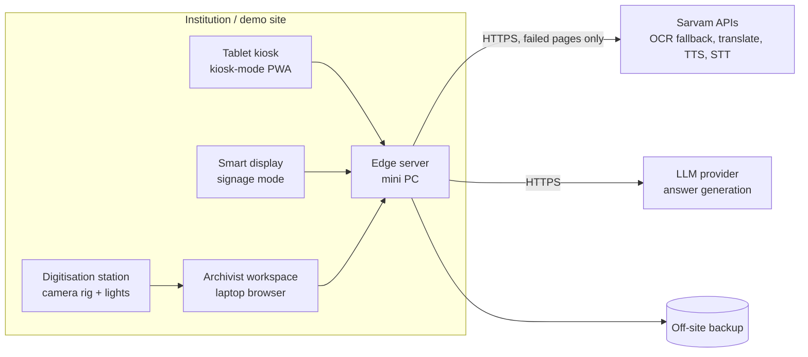
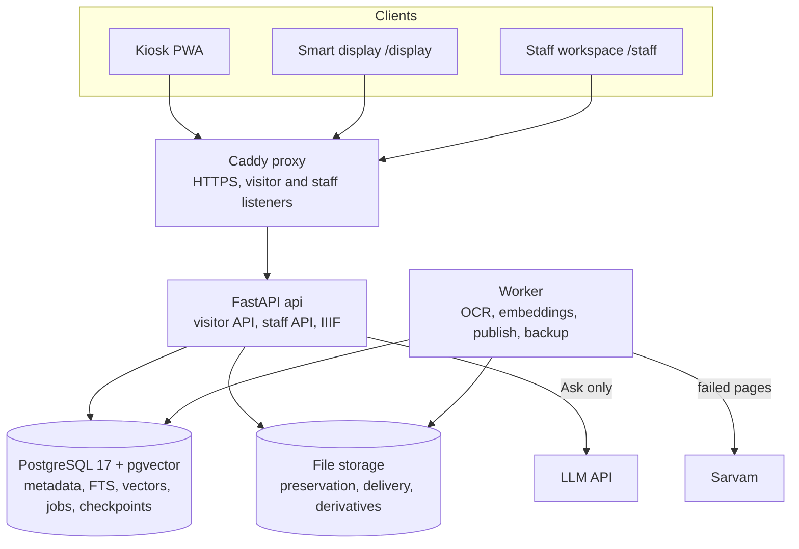
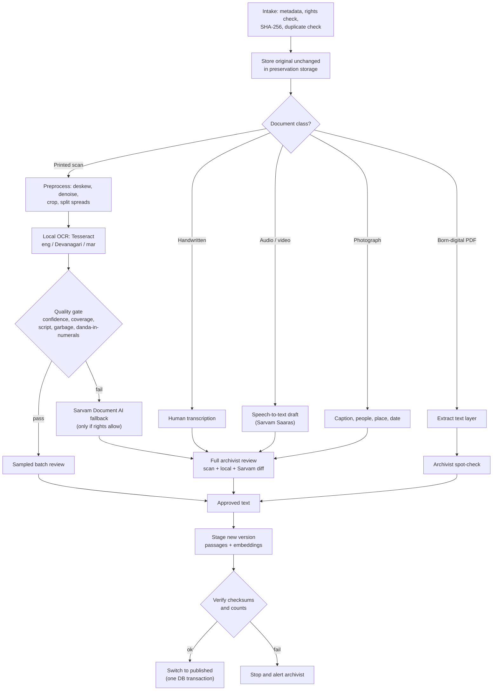
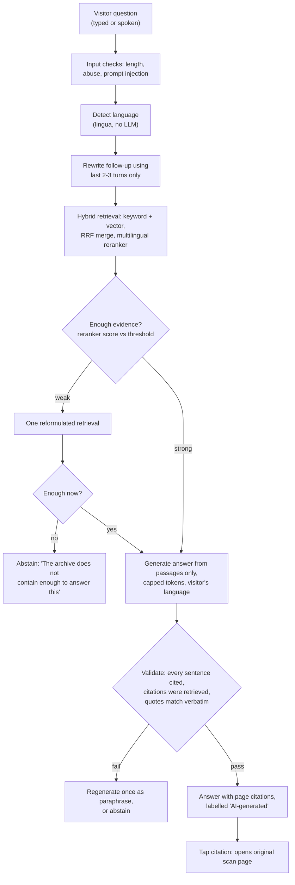

# Presentation content: Dr. B. R. Ambedkar Digital Heritage Archive

Source material for a four-section deck: technical approach; feasibility and viability; impact and benefits; research and references. Each section starts with **slide-ready bullets**, followed by the supporting detail, tables and diagrams to draw from.

Every figure here comes from a file in this repository, and the file is named beside it. Where something has not been measured, the document says so. Do not put an unmeasured number on a slide.

**Project in one line.** An AI-enabled digital heritage archive of Dr. B. R. Ambedkar's writings, speeches and the Constituent Assembly Debates. Scans are digitised with local OCR, checked by people and published with full provenance. Visitors search, read, listen and ask questions in English, Hindi and Marathi, and every answer is cited to the original page.

**Context.** Smart India Hackathon (SIH), Ministry of Social Justice and Empowerment (MoSJE) problem statement, Hardware category, Smart Education theme.

**Suggested deck order (about 10–12 slides)**

| # | Slide | Section |
| --- | --- | --- |
| 1 | Title, team, problem statement | — |
| 2 | Technology stack | 1 |
| 3 | System architecture (hardware tiers) | 1 |
| 4 | Ingestion pipeline: scan to published page | 1 |
| 5 | AI research assistant: bounded question flow | 1 |
| 6 | Working prototype (screenshots) | 1 |
| 7 | Feasibility: what already works, with evidence | 2 |
| 8 | Challenges, risks and mitigations | 2 |
| 9 | Impact on target audiences | 3 |
| 10 | Benefits: social, economic, environmental, institutional | 3 |
| 11 | Research and references | 4 |

---

## 1. Technical approach

### 1.1 Slide bullets: technologies

- **Frontend:** React 19 + TypeScript PWA (Vite), offline via Workbox service worker, OpenSeadragon deep-zoom viewer
- **Backend:** Python 3.12, FastAPI, SQLAlchemy 2, Alembic migrations
- **Database:** PostgreSQL 17 + pgvector: metadata, full-text search, vectors, workflow checkpoints and job queue in one store
- **AI workflows:** LangGraph state machines for ingestion and a bounded question-answering graph
- **OCR:** Tesseract 5 (English, Hindi Devanagari, Marathi) locally; Sarvam Document AI as a fallback for failed pages only
- **Semantic search:** multilingual MiniLM embeddings + Jina multilingual reranker, run locally with ONNX (no GPU needed)
- **Indian-language AI:** Sarvam APIs for translation, text-to-speech narration (Bulbul v3) and speech-to-text (Saaras v3)
- **Answer model:** any OpenAI-compatible LLM (demo used `gpt-4o-mini`); Whisper for spoken questions
- **Infrastructure:** Docker Compose, Caddy (HTTPS reverse proxy), FFmpeg, IIIF image API, Langfuse observability
- **Hardware:** edge mini PC server, Lenovo Android tablet kiosks, smart display, digitisation camera station

### 1.2 Full technology stack

| Layer | Technology | Version (from repo) | Why it was chosen |
| --- | --- | --- | --- |
| Kiosk, display and staff UI | React, React Router, TypeScript | React 19.3, TS 7 | One codebase serves the tablet kiosk, the smart display and the archivist workspace |
| Build and offline | Vite, vite-plugin-pwa, Workbox | Vite 8.3, Workbox 7.4 | Installable PWA; the service worker caches the published exhibit set for offline use |
| Scan viewer | OpenSeadragon | 6.1 | Deep zoom over IIIF tiles, so a reader sees the original page beside the text |
| Fonts | Noto Serif, Noto Serif Devanagari, Mukta | Fontsource 5.3 | Correct Devanagari rendering for Hindi and Marathi |
| API | FastAPI, Uvicorn, Pydantic 2 | FastAPI ≥ 0.115 | Typed, fast, async Python API for visitor (read-only) and staff routes |
| ORM and migrations | SQLAlchemy 2, Alembic, psycopg 3 | SQLAlchemy ≥ 2.0.30 | Versioned schema (4 migrations so far) |
| Database | PostgreSQL + pgvector | `pgvector/pgvector:0.8.1-pg17` | One service for metadata, keyword search, vector search and LangGraph checkpoints keeps the server small |
| Workflow engine | LangGraph + Postgres checkpointer | ≥ 0.6 | Ingestion that can pause for days of human review and resume; a fixed, auditable Q&A graph |
| Text splitting | LangChain text splitters | ≥ 0.3 | Passage chunking only; no agent executors |
| Local OCR | Tesseract 5 via pytesseract | `eng` / `hin` / `mar`; tessdata_best `Devanagari` | Won a benchmark against PaddleOCR and EasyOCR on CPU budget and Hindi accuracy (§2.3) |
| Image processing | OpenCV, Pillow, NumPy, imagehash | OpenCV ≥ 4.10 | Deskew, denoise, contrast normalisation, spread splitting, near-duplicate page hashes |
| PDF | pypdf, pypdfium2 | pypdf ≥ 5 | Text-layer extraction for born-digital PDFs; page rendering |
| Embeddings | `sentence-transformers/paraphrase-multilingual-MiniLM-L12-v2` via fastembed (ONNX) | 384-dim, 50+ languages | Cross-lingual retrieval: a Hindi query can find English source text; runs on CPU |
| Reranker | `jinaai/jina-reranker-v2-base-multilingual` | cross-encoder | Better top results, and its score drives the "enough evidence?" check |
| Language ID | lingua-language-detector | ≥ 2.0 | Detects question language without an LLM call |
| Fuzzy matching | rapidfuzz | ≥ 3.9 | Near-duplicate text detection, quote checks |
| Indian-language AI | Sarvam AI: Document Intelligence, Translate, TTS (Bulbul v3), STT (Saaras v3) | REST | Indian provider with strong Hindi and Marathi support |
| Offline narration | espeak-ng | 1.51 | Narration still works without the internet |
| Answer LLM | OpenAI-compatible API (demo: `gpt-4o-mini`) | configurable | Provider-agnostic; can be swapped for a self-hosted model |
| Voice question | OpenAI `whisper-1` | — | Push-to-talk spoken questions, transcribed for the visitor to edit |
| Media | FFmpeg | — | H.264 delivery copies, audio extraction, 16 kHz chunks for STT |
| Image serving | IIIF Image API (built into the API) | — | Standard deep-zoom tiles for scans |
| Security | Argon2 password hashing (pwdlib), JWT (PyJWT), cryptography | — | Staff sign-in with roles; signed kiosk exhibit manifests |
| Take-away | qrcode | ≥ 7.4 | QR code for a visitor's compiled collection, no login needed |
| Reverse proxy | Caddy | 2.10 | Automatic HTTPS, separate visitor and staff listeners |
| Observability | Langfuse (self-hosted), JSON logs | Langfuse ≥ 3.0 | Tokens, cost, latency and failures per question, with PII redaction |
| Containers | Docker Compose | — | Same stack on a laptop demo and the institution server |
| Testing | pytest, Vitest, Playwright, axe-core | Playwright 1.62 | Backend, unit, end-to-end kiosk and accessibility tests |
| Code quality | Ruff | — | Lint and formatting |

### 1.3 Hardware

| Tier | Prototype hardware | Purpose | Production equivalent |
| --- | --- | --- | --- |
| Visitor kiosk | Lenovo Android tablet on a lockable stand, headphone output | Touch browsing, reading, media, typed or spoken questions | Commercial touch kiosk, mains-powered, locked enclosure, induction loop |
| Smart display | TV or monitor in a full-screen browser | Signage loop of the timeline and stories | Commercial signage displays with managed players |
| Digitisation station | Overhead document camera or copy stand with mirrorless camera, two daylight lamps, colour/grey target, book cradle | Captures preservation-quality scans of printed pages and manuscripts | Professional book scanner or outsourced digitisation |
| Edge server | Mini PC, starting spec 32 GB RAM, 1 TB SSD, GPU optional | Local OCR, embeddings, search, database, API, exhibit cache | On-premise server pair plus preservation storage |
| External services | Sarvam APIs and one LLM API, reached only from the edge server | OCR fallback, translation, narration, answers | Same under contract, or self-hosted models |

**Design rule:** the tablet only renders. All inference and all calls to external AI services go through the edge server, which enforces rights, caching, redaction and cost limits. (Source: architecture spec §3.)

### 1.4 Slide bullets: methodology

- **Original first:** every scan, recording and photograph is stored unchanged with a SHA-256 checksum before any processing
- **Route by document type:** born-digital text is extracted; printed scans go to OCR; manuscripts go to human transcription; audio and video go to speech-to-text drafts
- **Quality gate:** each OCR page is scored on confidence, coverage, script consistency and garbage tokens; failed pages go to Sarvam and then to full human review
- **Human in the loop:** nothing reaches visitors until an archivist approves it; every decision is logged in a tamper-evident audit chain
- **Staged publication:** new versions are staged, verified, then switched in one database transaction, so visitors never see a half-published item
- **Hybrid search:** keyword and semantic results are merged by Reciprocal Rank Fusion, then reranked
- **Bounded AI assistant:** answers use only retrieved archive passages; every sentence is cited; the assistant abstains when evidence is weak
- **Zero-LLM browsing:** browsing, reading, timeline, stories, map and media make no AI calls, which keeps cost and error risk low

### 1.5 Flow chart: system architecture

### 1.6 Flow chart: software services on the edge server

### 1.7 Flow chart: ingestion pipeline (scan to published page)

Publication states: `draft → in_review → approved → staged → published → withdrawn`. A withdrawal blocks the item at the API at once; index, file and kiosk-cache cleanup follow in the background.

### 1.8 Flow chart: AI research assistant ("Ask the archive")

Policy rules built into the assistant:

- It refuses questions about what Dr. Ambedkar would think of current parties, politicians or events, and offers archive material instead.
- It never attributes a statement to Dr. Ambedkar unless the statement is in a cited passage.
- It quotes directly only from pages a person has compared word for word with the scan ("quote-verified").
- Where sources disagree, it says so and cites both.

### 1.9 Key design principles (good for a single slide)

1. The original scan or recording is the authority. OCR text, translations, summaries, narration and AI answers are labelled derivatives.
2. Visitors see only published, rights-cleared items.
3. Every passage shown or cited links back to the original page region or media timestamp, with edition and volume.
4. Browsing, timeline, reading and playback make **zero** LLM calls.
5. The AI answers only from the archive; if the archive does not support an answer, it says so.
6. Nothing is attributed to Dr. Ambedkar without a verifiable citation, and no synthetic audio imitates his voice.

### 1.10 Working prototype: features and screenshots

The prototype runs today as a Docker Compose stack at `https://localhost:8443` (see `README.md`).

| Feature | What the visitor or staff member does | Screenshot in repo |
| --- | --- | --- |
| Home | Collections, search, timeline, stories, Ask | `docs/e2e/visitor-01-home.png` |
| Semantic search | English query "hero worship" finds the 25 Nov 1949 speech | `docs/e2e/visitor-02-search-hero-worship.png` |
| Cross-language search | A Hindi query finds English source text | `docs/e2e/visitor-03-search-hindi-cross-language.png` |
| Reader | Approved text beside the original scan, with page arrows | `docs/e2e/visitor-04-reader-item12-p60.png`, `docs/a11y/item17-page-arrows.png` |
| Ask with AI | Cited answer from archive passages | `docs/e2e/visitor-05-ask-answer.png` |
| Citation opens original | Tapping a citation opens the cited scan page | `docs/e2e/visitor-06-ask-citation-opens-reader.png` |
| Timeline | Curated events linked to items | `docs/e2e/visitor-07-timeline.png` |
| Compile and QR take-away | Visitor builds a list and scans a QR code to take it home | `docs/e2e/visitor-08-shared-list.png`, `docs/e2e/visitor-09-list-qr.png` |
| Kiosk mode | Idle warning, reset, attract screen | `docs/a11y/02-home-kiosk-en.png` |
| Hindi, high contrast | Interface in Hindi with high-contrast mode | `docs/a11y/04-search-kiosk-hi-high-contrast.png` |
| Voice question | Push-to-talk spoken question | `docs/a11y/ask-voice-no-file.png` |
| Staff dashboard | Archive status and jobs | `docs/e2e/staff-01-dashboard.png` |
| Review queue | Pages waiting for human review | `docs/e2e/staff-02-review-queue.png` |
| Side-by-side OCR review | Scan, OCR text and correction on one screen | `docs/e2e/staff-03-page15-side-by-side-before.png`, `docs/e2e/staff-04-page15-after-approval.png` |
| Publication | Item ready, publish queued | `docs/e2e/staff-05-item12-ready.png`, `docs/e2e/staff-06-item12-publish-queued.png` |

Other built modules:

- Audio and video with a timestamped, human-reviewed transcript; tapping a line seeks the player.
- Photographs with reviewed captions and credit.
- Manuscripts shown beside a human transcription.
- Reviewed summaries (labelled "AI summary — not a quotation").
- Machine translation on demand (labelled "not reviewed") and reviewed translations.
- Synthetic narration, labelled as synthetic, using a generic stock voice.
- Knowledge map ("Connections") and memorial stories.
- Constitution articles linked to debate passages.
- Smart-display signage loop.
- Offline exhibit mode with a signed, expiring manifest.
- Staff roles: archivist, curator, reviewer, per-language translation reviewer, admin.
- Rights register, append-only audit log, and nightly backup with restore verification.

**Content in the live demo** (`CHANGELOG.md`, 2026-09-27). Four real English items are published, from the Writings and Speeches volumes and the Constituent Assembly Debates:

- Item 12: CAD, sitting of 25 Nov 1949, 62 pages.
- Item 17: *Castes in India* from Writings and Speeches Vol. 1, 20 pages.
- Item 18: the 25 Nov 1949 speech from Writings and Speeches Vol. 13, 13 pages.
- Item 20: CAD, sitting of 4 Nov 1948, 45 pages.

Three Hindi items (210 pages) have Sarvam OCR candidates and are still in review.

**Demo script (about 5 minutes, spec §8.5)**

1. Capture a printed page live at the station and ingest it with metadata. Show the checksum and duplicate check.
2. Run local OCR. One clean page passes the gate; one degraded page fails.
3. The failed page goes to Sarvam. Show both results and the diff.
4. The archivist corrects two words and approves. Show the review record and the switch to `published`.
5. Search a term on the tablet. The new page appears.
6. Ask: *"What did Dr. Ambedkar say about the dangers of hero-worship in politics?"* The answer cites the 25 Nov 1949 speech, and tapping the citation opens the original page.
7. Show the trace for step 6: tokens, cost and latency.

---

## 2. Feasibility and viability

### 2.1 Slide bullets: feasibility

- **Technically proven:** a working end-to-end prototype with 47 backend Python modules, a React PWA and 4 database migrations, run on one laptop in Docker
- **Real data already in:** 4 real Writings and Speeches and Constituent Assembly Debates items published (140 pages); 210 Hindi pages OCR'd and in review
- **Runs on modest hardware:** all local models are CPU-only (ONNX); Tesseract uses about 0.65 GB of RAM and about 5–6 CPU-seconds per Hindi page
- **Tested:** 304 backend test functions; 62 kiosk end-to-end tests (57 pass); 21 accessibility surfaces with zero axe violations
- **Recoverable:** backup restore drill passed with 604 of 604 files verified and all table counts matching, in 41.5 s
- **Low running cost:** browsing makes zero AI calls; only "Ask" and uncached translation use paid APIs
- **Open-source core:** PostgreSQL, FastAPI, React, Tesseract, LangGraph; no licence fees for the core stack

### 2.2 Feasibility analysis

| Dimension | Assessment | Evidence |
| --- | --- | --- |
| **Technical** | High. Every P1 software requirement has code; 5 of 13 problem-statement requirements are fully verified by tests, 8 are partial (mostly waiting on measurement or rights), none missing | `docs/PROBLEM_STATEMENT_CONFORMANCE.md` |
| **Hardware** | Moderate cost, off-the-shelf parts: mini PC, Android tablet, TV, camera stand. No GPU required | Spec §3.1; local models are ONNX on CPU (`backend/archive/search/models.py`) |
| **Data** | Official sources are available: MEA *Writings and Speeches* PDFs, Lok Sabha Secretariat CAD volumes. Written rights permission is still to be obtained | `docs/DATA_SOURCES.md` |
| **Operational** | Docker Compose deployment; nightly backup scheduled; restore drill documented; production layout with network separation already written | `deploy/production/`, `docs/ops/` |
| **Economic** | AI cost is only for Ask, translation on demand and OCR fallback on failed pages. Answer caching, bounded context and output caps limit tokens. Offline fallbacks (espeak-ng, extractive answers) mean the archive works with no paid API at all | Spec §6.1; `README.md` (`ARCHIVE_LLM_PROVIDER=none` gives extractive answers) |
| **Scalability** | A single server serves the demo; production adds API replicas behind Caddy, a DB replica, and a second machine for batch OCR if load tests require it | `docs/ops/topology.md`, spec §3.4 |
| **Legal and ethical** | Rights register before ingest; training permission recorded separately from display rights; no voice cloning; DPDP Act checklist for providers | Spec §6.2, §8.1; `backend/archive/rights.py` |

### 2.3 Measured evidence so far

**OCR engine benchmark** (`docs/OCR_ENGINE_EVAL.md`, 2026-09-27)

- **Sample:** 60 real pages (English and Hindi, Writings and Speeches and CAD), each scored clean and after synthetic degradation, 120 page-images per run.
- **Method:** decision rule locked before scores were read; paired bootstrap 95% confidence intervals.

| Engine | Hindi degraded CER | English degraded CER | CPU s/page | Verdict |
| --- | --- | --- | --- | --- |
| Tesseract baseline (`hin`, PSM 3) | 0.0433 | 0.0625 | 9–16 | Baseline |
| **Tesseract tessdata_best Devanagari + auto page segmentation** | **0.0329 (24% fewer errors)** | — | **5.3–6.1** | **Adopted for Hindi** |
| Tesseract fast, PSM auto | 0.0366 | 0.0316 (49% fewer) | 2.2 | English improvement |
| PaddleOCR v5 (CPU) | 0.0553 (28% worse) | 0.0085 | 34–136 | Rejected: Hindi regression, over CPU budget |
| EasyOCR 1.7.2 | — | — | 237–526 | Rejected: far over CPU budget |

On CAD Hindi pages, the Devanagari model raised recall of the digit "1" from 0 to 0.95–1.00, and of embedded English text from 0 to 0.88.

**Other measured results**

| What | Result | Source |
| --- | --- | --- |
| Backup and restore drill | 604/604 files, 602/602 file rows verified, all 12 key tables matching, audit chain OK, 41.5 s (same host, n = 1) | `eval/results/backup-restore-2026-09-27/`, `CHANGELOG.md` |
| Real database recovery | After Docker volumes were lost on 2026-09-27, the live archive was restored from the verified nightly backup | `CHANGELOG.md` |
| Kiosk end-to-end tests (Playwright) | 62 tests: 57 passed, 2 product bugs found, 2 skipped, 1 expected fail | `web/e2e/artifacts/suite-summary.json` |
| Accessibility | 21 visitor surfaces, zero axe violations; all 3 languages checked in jsdom | `docs/A11Y_I18N.md` |
| Interface languages | 490 interface strings in each of English, Hindi and Marathi | `CHANGELOG.md` |
| Live Ask smoke test | 33 of 33 checks passed, cited answer through the running stack | `CHANGELOG.md` |
| Narration | Live Sarvam TTS in English, Hindi and Marathi; second request is a cache hit with no API call | `docs/NARRATION.md` |
| Training dataset | Dataset v2 frozen: 641 passages from 11 items, with manifest | `CHANGELOG.md` |

**Not yet measured, and not to be claimed:** retrieval quality, answer-support rate, translation quality, latency, cost per answer, tablet battery, and server capacity under load. The harness and templates exist (`eval/`), but every row of `eval/RESULTS.md` is still UNMEASURED.

### 2.4 Slide bullets: challenges and risks

- **Historical misquotation:** AI may attribute words Dr. Ambedkar never said
- **OCR errors in old and Hindi documents:** legacy fonts, degraded scans, digits misread
- **Copyright and rights clearance** for the Writings and Speeches volumes and the Debates
- **AI hallucination** and unsupported claims
- **Political or religious misuse** of the assistant
- **Translation quality** in Hindi and Marathi
- **Internet outages** at the gallery
- **Human review bottleneck** for large volumes
- **Data loss or silent corruption** of irreplaceable originals
- **Privacy** of visitor questions; data sovereignty with external APIs

### 2.5 Risks, mitigations and status

| Risk | Why it matters | Mitigation | Status in the prototype |
| --- | --- | --- | --- |
| Historical misquotation | A false quote damages trust and the legacy | Quotes must match the cited passage exactly (string check); direct quotes only from human quote-verified pages; misattributed-quote test set; every citation carries edition, volume and page | Citation and quote validation built and tested (`TestAnswerValidation`) |
| OCR errors | Wrong text gets indexed and cited | Quality gate per page; Sarvam fallback; full review of failed pages; sampled review of passed pages; only approved text is indexed | Gate built; new Hindi checks for danda-in-numerals and mixed-script junk; thresholds still uncalibrated |
| Legacy-font Hindi PDFs (Kruti Dev) | The text layer extracts as garbage | Treat as printed scans and OCR them; never approve mojibake text layers | Found in real data and handled |
| AI hallucination | Unsupported claims in answers | Retrieval-only answers; evidence-sufficiency threshold; abstention; every sentence cited; claim support to be measured by human graders | Built; claim-support grading not yet run |
| Political or religious misuse | Visitors ask "what would Ambedkar say about party X?" | Policy refusal of current-affairs opinion questions; no attribution without citation; abuse and prompt-injection filter | Built (`TestAskPolicy`) |
| Copyright and rights | Content cannot be shown without permission | Rights register before ingest; server-side rights filter; training permission kept separate; NDLI links only | Built; written permission documents still to be filed |
| Translation errors | Misleading Hindi or Marathi text | Machine translation labelled "not reviewed"; named reviewer per language; original always one tap away | Built; native-speaker review pending |
| Voice misrepresentation | Synthetic audio mistaken for his voice | Narration labelled synthetic; generic stock voice only; the TTS API takes no reference audio | Built and tested |
| Connectivity loss | Kiosk goes blank at an exhibition | Offline PWA cache of the exhibit set; Ask shows "needs connection"; espeak-ng offline narration | Built; one offline e2e bug open |
| Withdrawn content on offline kiosks | Removed item still shown | Signed exhibit manifest with a lease; rights-sensitive items never cached; withdrawal list applied on reconnect | Built |
| Review bottleneck | Thousands of pages to check | Sampled batch review for passed pages; review-time measurement planned | Built; timing not measured |
| Data loss | Originals are irreplaceable | SHA-256 on ingest; read-only preservation masters; nightly backup; restore verification; 3-2-1 copies in production | Restore drill passed |
| Visitor privacy | Questions may contain personal data | No login at kiosk; PII scrubbing; traces store passage IDs, not text; session reset on idle | Built; redaction hardened |
| Provider lock-in or price change | Cost spikes, outage | All providers behind one internal interface; cached translations and narration; LLM is any OpenAI-compatible endpoint; works with no LLM | Built |
| Server overload | Ingestion slows visitors | Schedule ingestion off-hours with CPU caps; move batch work to a second machine if needed | Load test not yet run |
| Overfitting a small training set | A fine-tuned model looks better than it is | Split by work and edition; held-out test; minimum-data gate; base model kept as rollback | Gate built; not met, so nothing was trained |

### 2.6 Strategies for overcoming the challenges (slide version)

1. **Human-in-the-loop by design.** AI drafts; archivists approve. Every decision is audited.
2. **Cite everything.** Each answer sentence links to the original page, and quotes are checked character by character.
3. **Local first, cloud as fallback.** Local OCR and search on the edge server; external APIs only for failed pages and live answers.
4. **Measure before claiming.** Decision rules are written before benchmarks run. The OCR engine choice followed this rule.
5. **Rights before ingest.** Nothing is processed or shown without a rights record.
6. **Graceful degradation.** No LLM gives extractive answers; no Sarvam gives local narration; no internet gives the offline exhibit set.
7. **Tested recovery.** Nightly backups with checksum-verified restore drills.
8. **Phased roll-out.** P1 prototype, then P2 features (trained reranker, more languages, researcher portal), then PROD hardening (SSO, 3-2-1 backups, managed kiosks).

---

## 3. Impact and benefits

### 3.1 Slide bullets: impact on target audiences

- **Students:** a trustworthy, cited source for Ambedkar's ideas and the making of the Constitution, instead of unverified social-media quotes
- **Researchers and scholars:** full-text and semantic search across volumes, each result linked to the original page with edition and volume
- **General public and museum visitors:** touch-screen kiosks, stories and a timeline, in their own language, with audio narration
- **Hindi and Marathi speakers:** search in your language and find English source text; read reviewed translations; listen to narration
- **Visually impaired and low-literacy visitors:** narration, large touch targets, high-contrast mode, adjustable text size
- **Archivists and institutions** (MoSJE, Dr. Ambedkar Foundation, Dr. Ambedkar International Centre): digitisation, review, rights and preservation in one workflow

### 3.2 Target audience and impact detail

| Audience | Problem today | What changes with this system |
| --- | --- | --- |
| School and college students | Ambedkar's writings span many long volumes; misattributed quotes circulate widely | Ask plain questions and get short, cited answers; compile a reading list and take it home by QR code |
| Researchers and law students | Finding a passage across volumes and debates is slow; page and edition are often missing | Hybrid search; every hit gives edition, volume and page; the Constitution articles view links to the debate passages |
| Museum and memorial visitors | Static displays; little interaction | Touch kiosks, timeline, memorial stories, knowledge map and smart-display loops |
| Hindi and Marathi readers | Much material is only in English, or in legacy-font PDFs that cannot be searched | Cross-lingual search, reviewed translations, OCR of Hindi scans into searchable Unicode text, narration in 3 languages |
| People with disabilities | Print-only material | Audio narration, captions on video, transcripts, 48 px touch targets, high contrast, screen-reader labels |
| Archivists and institutions | Manual digitisation; fragile originals; no audit trail | Guided intake, automated OCR with a quality gate, side-by-side review, versioned publication, audit log and backups |

**Scale of the language reach.** At the 2011 Census, Hindi had about 52.8 crore speakers (43.6% of India) and Marathi about 8.3 crore (6.9%). With English, the three prototype languages cover a majority of Indian readers. The design adds more Indian languages in P2.

### 3.3 Slide bullets: benefits

- **Social:** protects Dr. Ambedkar's authentic words from distortion; spreads constitutional awareness; makes social-justice history accessible across languages and abilities
- **Educational:** a cited research assistant that teaches source-checking; material students can compile and take home
- **Economic:** open-source core with no licence fees; pay-per-use AI only where needed; one mini PC runs the prototype; one platform can be reused by other archives
- **Environmental:** fewer handling and printing cycles for fragile originals; the tablet does no AI work, which cuts device power use; CPU-only models need no GPU; caching avoids repeated API calls
- **Cultural and preservation:** checksummed, versioned preservation masters with tested backups, which safeguards national heritage
- **Governance and sovereignty:** originals, indexes and data stay on institution-controlled servers; Indian AI provider (Sarvam) for Indian languages

### 3.4 Benefits in detail

**Social benefits**

- Authentic access: every passage traces to the original scan. This counters misinformation and fake quotes attributed to Dr. Ambedkar.
- Constitutional awareness: Constituent Assembly Debate passages are linked to the Constitution articles they discuss.
- Inclusion: three languages, audio narration, accessible design and no login or personal data at the kiosk.
- Trust: AI output is always labelled ("AI-generated answer from archive sources", "Machine translation — not reviewed", "Synthetic narration").

**Educational benefits**

- The research assistant models good scholarship: it cites sources, abstains when unsure and refuses to put words in the author's mouth.
- Timeline, stories and the knowledge map give guided learning paths for school visits.
- The QR take-away extends learning beyond the visit.

**Economic benefits**

- Core stack is open source (PostgreSQL, FastAPI, React, Tesseract, LangGraph, Caddy): no software licence cost.
- Local OCR handles most pages; paid Sarvam OCR runs only on pages that fail the gate.
- Browsing costs nothing per visit. Only Ask makes LLM calls, and those are bounded by top-k passages, output caps, answer caching and daily cost alerts.
- Sampled batch review lowers archivist hours per page compared with full review of every page.
- Reusable: the same platform suits any Indian archive or memorial (other national leaders, state archives, university libraries).

**Environmental benefits**

- Digital access reduces physical handling, photocopying and printing of fragile originals.
- The kiosk only renders; it keeps a local cache and a screen-sleep idle policy.
- CPU-only local models avoid GPU hardware and its power draw.
- Caching of answers, narration and translations avoids repeated compute and network use.
- Storage efficiency: deduplication by checksum; delivery copies are compressed while masters stay lossless.

**Institutional and preservation benefits**

- SHA-256 fixity on every original; read-only preservation masters; append-only, hash-chained audit log.
- Versioned text: a correction creates a new version, and old citations still resolve.
- Nightly backups with verified restores; production design with 3-2-1 copies.
- Role-based staff workflow: archivist, reviewer, curator, translation reviewer per language, admin.
- Data sovereignty: originals and indexes stay on institution servers; the provider due-diligence checklist follows the DPDP Act, 2023.

### 3.5 Alignment with national priorities

| Priority | How the project supports it |
| --- | --- |
| MoSJE mandate on Dr. Ambedkar's legacy | Directly implements the SIH problem statement for a digital heritage archive |
| Digital India | Digitises and makes searchable national heritage material |
| National Education Policy 2020 (multilingual learning) | Learning in Indian languages; English, Hindi and Marathi in P1 |
| Indigenization and Atmanirbhar Bharat | Indian AI provider for Indian languages; institution-owned infrastructure |
| Accessibility (GIGW, WCAG) | Designed to WCAG guidance; automated audit passing; manual audit planned before launch |
| DPDP Act, 2023 | No personal data collected at kiosks; PII redaction; provider data-handling checklist |

---

## 4. Research and references

### 4.1 Slide bullets

- **Primary sources:** *Dr. Babasaheb Ambedkar: Writings and Speeches* (MEA and Dr. Ambedkar Foundation); Constituent Assembly Debates (Lok Sabha Secretariat)
- **Research:** Retrieval-Augmented Generation; Reciprocal Rank Fusion; multilingual sentence embeddings; cross-encoder reranking; Tesseract OCR
- **Standards:** IIIF (image delivery); ALTO and hOCR (OCR layout); PREMIS (preservation events); WCAG 2.1 and GIGW (accessibility)
- **Own evaluation:** OCR engine benchmark on 120 page-images (Tesseract vs PaddleOCR vs EasyOCR)

### 4.2 Primary data sources

| Source | Link | Use in project |
| --- | --- | --- |
| *Writings and Speeches*, official MEA listing | https://www.mea.gov.in/books-writings-of-ambedkar | Master listing of the volumes |
| *Writings and Speeches* Vol. 1 (English) | https://www.mea.gov.in/images/CPV/Volume1.pdf | *Castes in India* chapter (item 17) |
| *Writings and Speeches* Vol. 13 (English) | https://www.mea.gov.in/images/CPV/Volume13.pdf | 25 Nov 1949 speech (item 18) |
| *Dr. Ambedkar Sampoorna Vangmay* Khand 1 (Hindi) | https://www.mea.gov.in/images/CPV/VolumeH1.pdf | Hindi OCR path (item 19) |
| Constituent Assembly Debates, 4 Nov 1948 (English) | https://sansad.in/uploads/const_Assmbly_Debates_Volume7_4_November1948_64efedfedd.pdf | Introduction of the Draft Constitution (item 20) |
| Constituent Assembly Debates, 25 Nov 1949 (English) | https://eparlib.sansad.in/handle/123456789/763285 | Debates collection (item 12) |
| Constituent Assembly Debates, Hindi, Vol. 7 and 11 | https://eparlib.sansad.in/handle/123456789/763480, https://eparlib.sansad.in/handle/123456789/763515 | Hindi scanned-debate OCR (items 13, 14) |
| *Writings and Speeches*, all volumes (Internet Archive, MoSJE upload) | https://archive.org/details/Dr.BabasahebAmbedkarWritingsAndSpeechespdfsAllVolumes | Alternate host |
| *Writings and Speeches* Vol. 1, DLI scan | https://archive.org/details/in.ernet.dli.2015.7747 | Candidate for OCR comparison |
| Constituent Assembly Debates Vol. 1 (Internet Archive) | https://archive.org/details/eparlib.nic.in.760449 | Reference |
| CADIndia (CLPR) | https://clpr.org.in/blog/constituent-assembly-debates-website-cadindia/ | Derived version of the Debates; reference only |
| Lok Sabha e-library copyright policy | https://elibrary.sansad.in/copyright-policy | Rights basis for the Debates |
| National Digital Library of India (NDLI) | https://ndl.iitkgp.ac.in/ | Discovery and links only; no content ingested |
| Dr. Ambedkar Foundation (MoSJE) | https://ambedkarfoundation.nic.in/ | Rights holder of the reprints and translations |

### 4.3 Research papers behind the methods

| Method used | Reference |
| --- | --- |
| Retrieval-Augmented Generation (answers grounded in retrieved passages) | Lewis, P. et al. (2020). *Retrieval-Augmented Generation for Knowledge-Intensive NLP Tasks.* NeurIPS 2020. https://arxiv.org/abs/2005.11401 |
| Reciprocal Rank Fusion (merging keyword and semantic results) | Cormack, G. V., Clarke, C. L. A., Büttcher, S. (2009). *Reciprocal Rank Fusion Outperforms Condorcet and Individual Rank Learning Methods.* SIGIR 2009. https://doi.org/10.1145/1571941.1572114 |
| Sentence embeddings | Reimers, N., Gurevych, I. (2019). *Sentence-BERT: Sentence Embeddings using Siamese BERT-Networks.* EMNLP 2019. https://arxiv.org/abs/1908.10084 |
| Multilingual embeddings (Hindi query finds English text) | Reimers, N., Gurevych, I. (2020). *Making Monolingual Sentence Embeddings Multilingual using Knowledge Distillation.* EMNLP 2020. https://arxiv.org/abs/2004.09813 |
| Compact embedding model | Wang, W. et al. (2020). *MiniLM: Deep Self-Attention Distillation for Task-Agnostic Compression of Pre-Trained Transformers.* NeurIPS 2020. https://arxiv.org/abs/2002.10957 |
| Cross-encoder reranking | Nogueira, R., Cho, K. (2019). *Passage Re-ranking with BERT.* https://arxiv.org/abs/1901.04085 |
| Dense retrieval | Karpukhin, V. et al. (2020). *Dense Passage Retrieval for Open-Domain Question Answering.* EMNLP 2020. https://arxiv.org/abs/2004.04906 |
| Tesseract OCR engine | Smith, R. (2007). *An Overview of the Tesseract OCR Engine.* ICDAR 2007. https://doi.org/10.1109/ICDAR.2007.4376991 |
| LLM hallucination (why answers are cited and validated) | Ji, Z. et al. (2023). *Survey of Hallucination in Natural Language Generation.* ACM Computing Surveys. https://arxiv.org/abs/2202.03629 |
| Bootstrap confidence intervals (used in the OCR benchmark) | Efron, B., Tibshirani, R. (1993). *An Introduction to the Bootstrap.* Chapman & Hall |
| Evaluation metrics (MRR, nDCG, Recall@k) | Järvelin, K., Kekäläinen, J. (2002). *Cumulated Gain-Based Evaluation of IR Techniques.* ACM TOIS. https://doi.org/10.1145/582415.582418 |

### 4.4 Models, tools and APIs

| Item | Link |
| --- | --- |
| paraphrase-multilingual-MiniLM-L12-v2 | https://huggingface.co/sentence-transformers/paraphrase-multilingual-MiniLM-L12-v2 |
| jina-reranker-v2-base-multilingual | https://huggingface.co/jinaai/jina-reranker-v2-base-multilingual |
| fastembed (ONNX runtime for embeddings) | https://github.com/qdrant/fastembed |
| Tesseract OCR | https://github.com/tesseract-ocr/tesseract |
| tessdata_best (Devanagari script model) | https://github.com/tesseract-ocr/tessdata_best |
| PaddleOCR (benchmarked, rejected) | https://github.com/PaddlePaddle/PaddleOCR |
| EasyOCR (benchmarked, rejected) | https://github.com/JaidedAI/EasyOCR |
| Sarvam Document Intelligence API | https://docs.sarvam.ai/api/api-guides-tutorials/document-intelligence/overview |
| Sarvam Vision | https://www.sarvam.ai/blogs/sarvam-vision |
| Sarvam Speech-to-Text API | https://docs.sarvam.ai/api-reference-docs/speech-to-text/transcribe |
| Sarvam API docs (Translate, TTS) | https://docs.sarvam.ai/ |
| lingua language detector | https://github.com/pemistahl/lingua-py |
| LangGraph | https://langchain-ai.github.io/langgraph/ |
| LangChain | https://python.langchain.com/ |
| Langfuse | https://langfuse.com/docs |
| FastAPI | https://fastapi.tiangolo.com/ |
| PostgreSQL full-text search | https://www.postgresql.org/docs/17/textsearch.html |
| pgvector | https://github.com/pgvector/pgvector |
| React | https://react.dev/ |
| Vite PWA plugin | https://vite-pwa-org.netlify.app/ |
| Workbox | https://developer.chrome.com/docs/workbox |
| OpenSeadragon | https://openseadragon.github.io/ |
| Caddy | https://caddyserver.com/docs/ |
| FFmpeg | https://ffmpeg.org/documentation.html |
| espeak-ng | https://github.com/espeak-ng/espeak-ng |
| OpenAI Whisper | https://github.com/openai/whisper |
| Playwright | https://playwright.dev/ |
| axe-core | https://github.com/dequelabs/axe-core |

### 4.5 Standards and policy

| Standard or policy | Link | Use |
| --- | --- | --- |
| IIIF Image API 3.0 | https://iiif.io/api/image/3.0/ | Deep-zoom scan delivery |
| ALTO XML | https://www.loc.gov/standards/alto/ | OCR word boxes and confidence |
| hOCR | https://kba.github.io/hocr-spec/1.2/ | OCR layout format |
| PREMIS (preservation metadata) | https://www.loc.gov/standards/premis/ | Model for preservation events |
| Dublin Core | https://www.dublincore.org/specifications/dublin-core/dcmi-terms/ | Metadata fields |
| WCAG 2.1 | https://www.w3.org/TR/WCAG21/ | Accessibility |
| GIGW (Guidelines for Indian Government Websites) | https://guidelines.india.gov.in/ | Accessibility and government web compliance |
| Digital Personal Data Protection Act, 2023 | https://www.meity.gov.in/data-protection-framework | Visitor privacy and provider checks |
| Census of India 2011, language data | https://censusindia.gov.in/census.website/data/census-tables | Speaker counts in §3.2 |
| 3-2-1 backup rule | https://www.backblaze.com/blog/the-3-2-1-backup-strategy/ | Production backup policy |

### 4.6 Project documents in this repository

| Document | What it contains |
| --- | --- |
| `Ambedkar Digital Heritage Archive — Revised Architecture Spec.md` | Full architecture, data model, prototype scope, evaluation plan, risks |
| `docs/PROBLEM_STATEMENT_CONFORMANCE.md` | Each of the 13 problem-statement requirements mapped to code and tests |
| `docs/REQUIREMENTS.md` | Per-requirement status and evidence |
| `docs/OCR_ENGINE_EVAL.md` | OCR benchmark method and results |
| `docs/DATA_SOURCES.md` | Rights register and source checksums |
| `docs/NARRATION.md`, `docs/SPEECH_TO_TEXT.md` | Narration and speech-to-text rules and tests |
| `docs/A11Y_I18N.md` | Accessibility and language work |
| `docs/ops/` | Production topology, HTTPS, backups, secrets, health |
| `eval/RESULTS.md` | Evaluation results table (currently all unmeasured) |
| `CHANGELOG.md` | Dated record of what was built, ingested and tested |

---

## Appendix: numbers safe to put on slides

Use only these, each with its source. Anything else needs a measurement first.

| Claim | Value | Source |
| --- | --- | --- |
| Problem-statement requirements covered | 13 of 13 have code; 5 verified, 8 partial | `docs/PROBLEM_STATEMENT_CONFORMANCE.md` |
| Real items published | 4 English items, 140 pages | `CHANGELOG.md` |
| Hindi pages OCR'd with Sarvam, in review | 209 of 210 | `CHANGELOG.md` |
| Hindi OCR improvement from the model choice | 24% fewer character errors on degraded pages (0.0433 → 0.0329) | `docs/OCR_ENGINE_EVAL.md` |
| OCR benchmark size | 60 real pages, 120 page-images, 5 engine configurations | `docs/OCR_ENGINE_EVAL.md` |
| Restore drill | 604/604 files verified, 41.5 s | `CHANGELOG.md`, `eval/results/backup-restore-2026-09-27/` |
| Interface languages | 3 (English, Hindi, Marathi), 490 strings each | `CHANGELOG.md` |
| Accessibility | 21 surfaces, 0 automated violations | `docs/A11Y_I18N.md` |
| Kiosk e2e tests | 57 of 62 passed | `web/e2e/artifacts/suite-summary.json` |
| Backend test functions | 304 | `backend/tests/` |
| Frozen dataset | 641 passages, 11 items | `CHANGELOG.md` |
| LLM calls when browsing | 0 by design (Ask is the only LLM path) | Spec §1, principle 4 |

Hindi and Marathi interface text and all review decisions in the demo were drafted by AI agents and still await native-speaker and archivist review. Say so if asked.
