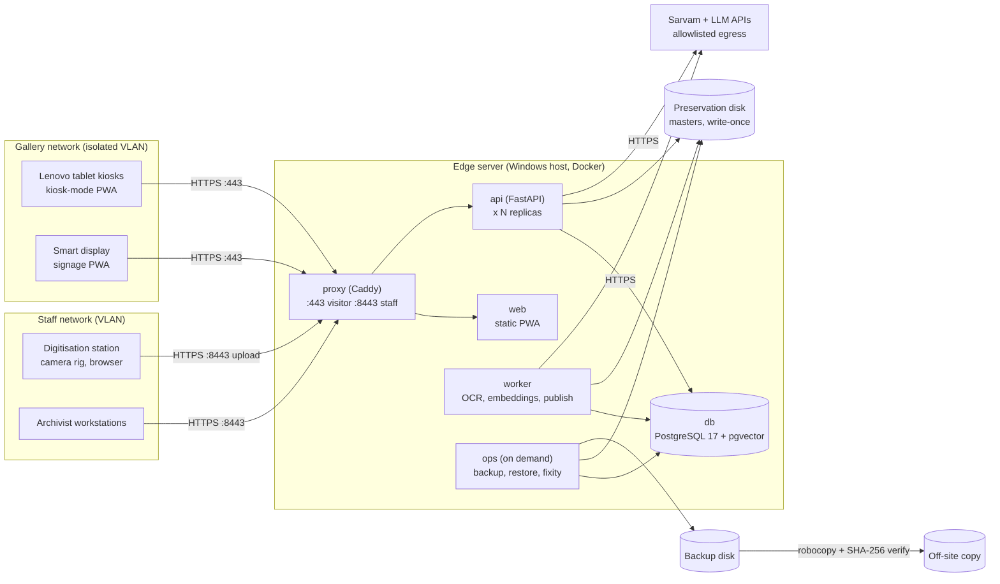

# Production topology [PROD]

Implements spec section 9 on one institution server with a modest service count. All heavy processing (OCR, embeddings, reranking, FFmpeg, publication) runs on the server. Tablets and displays only render.

## Physical path

**Page capture station → edge server → Lenovo tablet kiosks and smart display.**

1. **Capture.** The digitisation station is a staff-network browser. It uploads through the staff listener (`/staff/intake`), or drops batches with a manifest into the intake folder for `archive.cli import-manifest`.
2. **Edge server.** The api stores the original on the preservation disk with SHA-256 before any processing. The worker runs local OCR, the quality gate, the Sarvam fallback, embeddings and staged publication.
3. **Kiosks and smart display.** They reach only the gallery listener. They get published, rights-cleared items and the signed exhibit manifest, and cache exhibits offline within the lease.

## Services

| Service | Image | Role | Networks | Persistent data |
| --- | --- | --- | --- | --- |
| `db` | `pgvector/pgvector:0.8.1-pg17` | Metadata, review state, passages, FTS, vectors, LangGraph checkpoints, job queue | data | `pgdata` volume |
| `migrate` | `ambedkar-archive/api:<tag>` | One-shot: `alembic upgrade head`, then `archive.cli bootstrap` | data | none |
| `api` | `ambedkar-archive/api:<tag>` | Visitor API, staff API, IIIF | app, data, egress | preservation, delivery, derivatives, quarantine, traces |
| `worker` | `ambedkar-archive/api:<tag>` | Job queue: ingest, publish, Sarvam retry, withdrawal cleanup | data, egress | same as api |
| `web` | `ambedkar-archive/web:<tag>` | Static PWA (kiosk, display, staff routes) on `:8080`, read-only root filesystem | app | none |
| `proxy` | `caddy:2.10-alpine` | HTTPS, visitor/staff boundary, load balancing across api replicas | public, app | `caddy_data`, `caddy_config` |
| `ops` (profile) | `ambedkar-archive/ops:<tag>` | Backup, restore, fixity, audit verify, manifest import; PostgreSQL 17 client tools | data | adds backup disk, restore staging, intake (read-only) |

Every app container runs as a non-root user with all Linux capabilities dropped, except `NET_BIND_SERVICE` on the two Caddy containers, and with `no-new-privileges`.

## Networks

| Network | Internal | Members | Why |
| --- | --- | --- | --- |
| `public` | no | proxy | The only network with published ports |
| `app` | yes | proxy, web, api | The proxy reaches the PWA and the api. No internet route |
| `data` | yes | db, migrate, api, worker, ops | The database is unreachable from the proxy and has no published port |
| `egress` | no | api, worker | Outbound HTTPS to Sarvam, the LLM provider and Langfuse. Restrict destinations at the host or network firewall |

## Access boundary

| | Gallery listener (`VISITOR_SITE`, container `:443`, plus `:80` redirect) | Staff listener (`STAFF_SITE`, container `:8443`) |
| --- | --- | --- |
| Clients | Kiosks, smart displays | Archivist workstations, digitisation station |
| Host binding | `VISITOR_BIND_IP` (gallery NIC) | `STAFF_BIND_IP` (staff NIC) |
| Routed to api | `/api/visitor/*`, `/iiif/*`, `/api/health` only | `/api/*`, `/iiif/*` |
| Everything else under `/api/` | 404 (staff API, `/api/health/ready`, `/api/docs`) | routed |
| `/staff` screens | redirect to `/` | served |
| Request body limit | 64 KB | `STAFF_MAX_UPLOAD` (default 2 GB) |

The two sites are separate container ports, not just separate hostnames. A client on the gallery binding cannot reach the staff site by forging `Host` or SNI; such requests get an empty response and nothing is proxied (tested). The api also authenticates every staff route independently. See [https-and-access.md](https-and-access.md) for firewall rules.

## Storage

| Data | Where | Notes |
| --- | --- | --- |
| Preservation masters | `PRESERVATION_PATH` bind mount (dedicated disk) | Content-addressed, write-once, read-only files. Start-up fails if the path is missing. Preflight also requires the marker file `.archive-preservation-volume` |
| Database | `pgdata` named volume | On Docker Desktop this lives in the WSL2 disk image. Move the image to a data disk (Settings > Resources > Advanced > Disk image location). Protected by `pg_dump` backups |
| Delivery copies, derivatives, exhibit signing key | `delivery`, `derivatives` named volumes | Included in backups |
| Quarantine, traces | named volumes | Not backed up |
| Backups | `BACKUP_PATH` (different physical disk) | Mounted only into `ops` |
| Restore staging | `RESTORE_STAGING_PATH` | Mounted only into `ops` |
| Capture intake | `INTAKE_PATH` | Read-only, `ops` only |

## Capacity-scaling path

Numbers come from the spec 3.4 benchmark, not from this document.

| Stage | What changes | How |
| --- | --- | --- |
| 0. Demo | Root `docker-compose.yml` on the mini PC | Prototype only |
| 1. Single production host | This compose file | `Invoke-ReleaseBuild.ps1`, then `up -d` |
| 2. Scale on the same host | More api replicas for visitor load; more workers for ingestion backlog; CPU caps keep visitors first | `docker compose --env-file .env -f compose.yaml up -d --scale api=2 --scale worker=2`. Raise `API_CPUS`/`API_MEM`. Each api replica loads its own embedding and reranker models, so budget RAM per replica. Scale after the first start, so the LangGraph checkpointer tables already exist |
| 3. Split ingestion (spec 3.4 order) | Schedule ingestion outside visitor hours. Move Langfuse to its own machine. Then move the worker to a second machine | The second machine runs only `worker` from the same images. It needs the preservation, delivery and derivative storage on shared SMB/NFS and a network route to the database. **Not provided as a compose file here**; design it from the benchmark result |
| 4. Spec 9 full | Two application servers, PostgreSQL primary + replica, load balancer, preservation storage with snapshots and a second site | Beyond single-host Compose. Needs shared or object storage and database replication. Design only |

Job claiming uses `SELECT ... FOR UPDATE SKIP LOCKED`, so multiple workers are safe. The proxy discovers api replicas through Docker DNS (`dynamic a api 8000`) and balances with `least_conn`.
